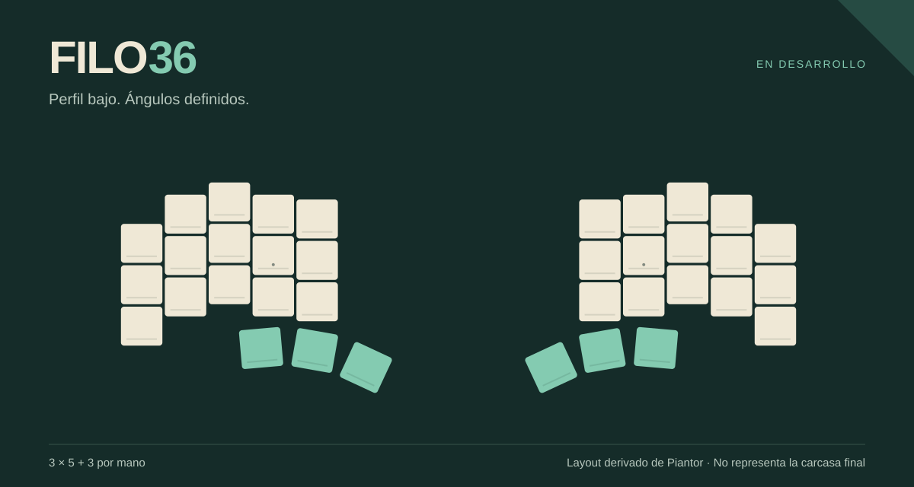

# Filo36

**36 teclas. Líneas angulares. Un split para construir a tu manera.**

Un teclado dividido de perfil bajo, en desarrollo por [Eduardo Ruiz](https://github.com/eduarbo). Conserva los centros y ángulos de Piantor, con cinco columnas por mano y tres teclas de pulgar. Filo36 es el nombre provisional.

Buscamos una carcasa ajustada al layout, conexión Bluetooth entre mitades y al equipo, switches Choc v1 hot-swap y keycaps KLP Lamé imprimibles. La siguiente revisión apila **batería → micro → pantalla** para reducir la bahía electrónica y facilitar el mantenimiento.

**Estado: prototipo digital.** El layout de 36 teclas está comprobado. La revisión estrecha y modular está en diseño; todavía no hay una versión probada físicamente ni archivos finales para fabricar.

| Ya definido | En desarrollo |
|---|---|
| 36 posiciones y ángulos heredados de Piantor | Bahía electrónica más estrecha |
| Choc v1 y KLP Lamé Choc Stem / Choc Size | MCU, batería y pantalla extraíbles |
| ZMK y dos nice!nano v2 como base | Dos nice!view; una si la segunda complica el conjunto |
| Carcasa y teclas imprimibles | Encaje, autonomía y pruebas reales |

**[Progreso](docs/progress.md) · [Diseño](docs/design.md) · [Piezas y alternativas](docs/parts.md) · [Construcción](docs/build.md)**

Este primer repositorio comparte el layout verificable y las decisiones de diseño. Las PCB, el CAD y el firmware de la revisión modular se incorporarán conforme se revisen. El diagrama superior muestra posiciones de teclas; no representa la carcasa final.

¿Quieres aportar? Consulta [cómo colaborar](CONTRIBUTING.md).

Basado en [Piantor de beekeeb](https://github.com/beekeeb/piantor), con [KLP Lamé de braindefender](https://github.com/braindefender/KLP-Lame-Keycaps). [Créditos y licencias](ATTRIBUTION.md).
