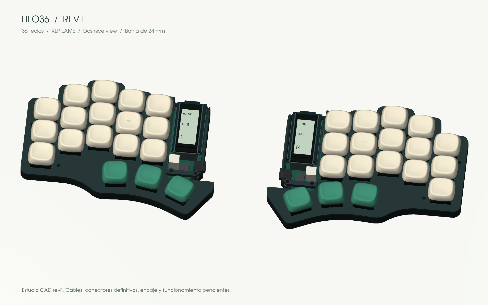

# Filo36

**36 teclas. Líneas angulares. Un split para construir a tu manera.**

**[Explorar en 3D →](https://eduarbo.github.io/filo36/)** · **[Editar con FreeCAD + KiCad →](docs/freecad.md)**

*RevF: marco abierto de 16,6 mm, batería rebajada en el PCB y USB accesible. Estudio editable; montaje físico pendiente.*

Un teclado dividido de perfil bajo, en desarrollo por [Eduardo Ruiz](https://github.com/eduarbo). Conserva los centros y ángulos de Piantor, con cinco columnas por mano y tres teclas de pulgar. Filo36 es el nombre provisional.

Buscamos una carcasa ajustada al layout, conexión Bluetooth entre mitades y al equipo, switches Choc v1 hot-swap y keycaps KLP Lamé imprimibles. La revisión actual apila **batería → micro → pantalla**, con laterales abiertos y soportes independientes.

**Diseñado para editarlo con herramientas gratuitas:** KiCad para la electrónica, FreeCAD para la carcasa y StepUp para reunirlos. Incluimos un **FCStd nativo con parámetros**, esquemas y PCB de colocación, modelos relativos y [tres ejemplos de edición](docs/freecad.md#tres-ejemplos-para-aprender).

**Estado: prototipo digital.** Centros y ángulos de las 36 teclas comprobados. El PCB revF todavía no tiene rutas; faltan cableado, fijación del retenedor y encaje físico. La abertura de batería incumple el margen de cobre configurado; hay que corregir el DRC antes de fabricar.

| Ya definido | En desarrollo |
|---|---|
| 36 posiciones y ángulos heredados de Piantor | PCB y firmware de la revisión modular |
| Bahía de **24 mm**, con marco abierto | Cableado y encaje de componentes reales |
| Dos nice!view sobre los micros en el CAD | Conectores, retención y extracción comprobadas |
| Plate a **7,6 mm**; marco a **16,6 mm** | Impresión de prueba, BLE y consumo medido |

**[Progreso](docs/progress.md) · [Diseño](docs/design.md) · [Piezas y alternativas](docs/parts.md) · [Construcción](docs/build.md)**

El render y el visor usan el mismo CAD revF, con KLP Lamé originales. [Vista superior, perfil y stack](docs/design.md#vistas-del-cad). [Archivos y reproducción](docs/cad.md). RevE se conserva como referencia. Una pantalla sigue siendo la alternativa si integrar dos complica el conjunto.

¿Quieres aportar? Consulta [cómo colaborar](CONTRIBUTING.md).

Basado en [Piantor de beekeeb](https://github.com/beekeeb/piantor), con [KLP Lamé de braindefender](https://github.com/braindefender/KLP-Lame-Keycaps). [Créditos y licencias](ATTRIBUTION.md).
