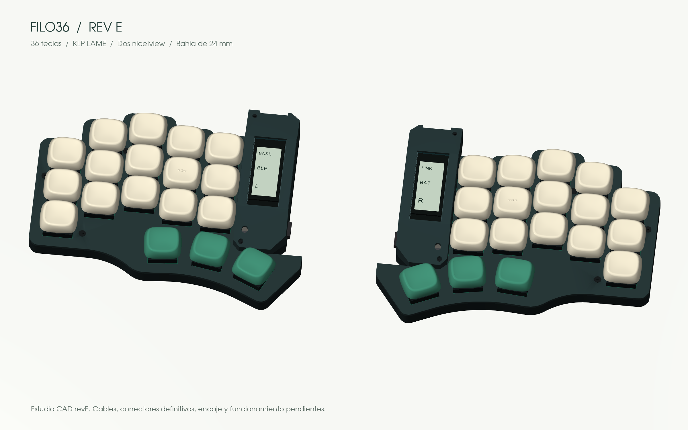

# Filo36

**36 teclas. Líneas angulares. Un split para construir a tu manera.**

*Nuevo estudio CAD revE: bahía de 24 mm, stack vertical y tapa electrónica independiente. Cables y montaje físico pendientes.*

Un teclado dividido de perfil bajo, en desarrollo por [Eduardo Ruiz](https://github.com/eduarbo). Conserva los centros y ángulos de Piantor, con cinco columnas por mano y tres teclas de pulgar. Filo36 es el nombre provisional.

Buscamos una carcasa ajustada al layout, conexión Bluetooth entre mitades y al equipo, switches Choc v1 hot-swap y keycaps KLP Lamé imprimibles. Esta revisión mecánica apila **batería → micro → pantalla** para reducir la bahía electrónica y facilitar el mantenimiento.

**Estado: prototipo digital.** El layout de 36 teclas está comprobado. La nueva carcasa está modelada y renderizada; todavía faltan el ruteo de PCB, los cables y la comprobación física. Los archivos son un estudio de diseño, no una versión final para fabricar.

| Ya definido | En desarrollo |
|---|---|
| 36 posiciones y ángulos heredados de Piantor | PCB y firmware de la revisión modular |
| Bahía de **24 mm** frente a 33,52 mm de revD | Cableado y encaje de componentes reales |
| Dos nice!view sobre los micros en el CAD | Conectores, retención y extracción comprobadas |
| Plate a **7,6 mm**; cubierta electrónica a **19 mm** | Impresión de prueba, BLE y consumo medido |

**[Progreso](docs/progress.md) · [Diseño](docs/design.md) · [Piezas y alternativas](docs/parts.md) · [Construcción](docs/build.md)**

El render usa el nuevo CAD y las mallas reales KLP Lamé. [Vista superior, perfil y stack](docs/design.md#vistas-del-cad). [Fuentes y reproducción](docs/cad.md). La variante de una pantalla sigue disponible si integrar dos complica demasiado el conjunto.

¿Quieres aportar? Consulta [cómo colaborar](CONTRIBUTING.md).

Basado en [Piantor de beekeeb](https://github.com/beekeeb/piantor), con [KLP Lamé de braindefender](https://github.com/braindefender/KLP-Lame-Keycaps). [Créditos y licencias](ATTRIBUTION.md).
