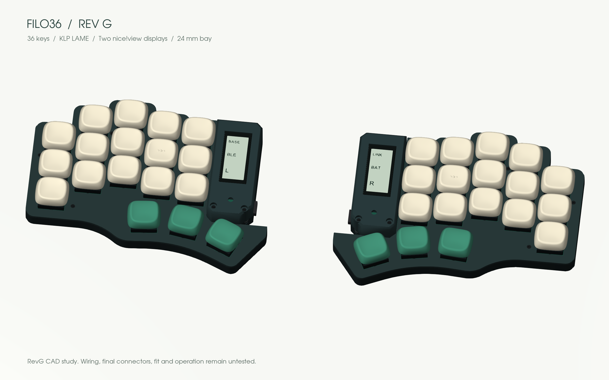

# Filo36

**36 keys. Piantor angles. Your keycaps, your frames.**

**[Explore and customize in 3D →](https://eduarbo.github.io/filo36/)** · **[Parts and buying links →](docs/parts.md)** · **[Edit in FreeCAD →](docs/freecad.md)**

*RevG: opaque display frames replace the open rails. Same 24 mm electronics bay and 16.6 mm maximum cover height. Nominal CAD study; physical fit untested.*

Filo36 is a low-profile wireless split keyboard in development by [Eduardo Ruiz](https://github.com/eduarbo). It keeps Piantor’s key centers and angles, with five columns and three thumb keys per half. The name is provisional.

- **KLP Lamé choices:** all 38 Choc-stem variants catalogued; 28 qualify in at least one position. The viewer checks complete combinations and exports a configuration for FreeCAD.
- **Interchangeable frames:** smooth, beveled or faceted, with separate colors per half. Opaque skirts hide the stack; the display has its own support.
- **Free tools:** KiCad for electronics, FreeCAD for the case, StepUp for exchange. Editable source, STEP/STL, offline viewer and GLB included.
- **Intended hardware:** Choc v1 hot-swap, two nice!nano controllers and two nice!view displays. One display remains the fallback.

**Status: digital prototype, not ready to manufacture.** Both PCB studies are unrouted and have unresolved DRC findings. Wiring, connectors, retention, printed fits, BLE and power consumption still require work. The visual model does not establish hardware compatibility.

**[Keycaps and frames](docs/customize.md) · [Design](docs/design.md) · [Build](docs/build.md) · [CAD files](docs/cad.md) · [Progress](docs/progress.md)**

Based on [Piantor by beekeeb](https://github.com/beekeeb/piantor), with [KLP Lamé by braindefender](https://github.com/braindefender/KLP-Lame-Keycaps). [Credits and licenses](ATTRIBUTION.md). [Contributing](CONTRIBUTING.md).
