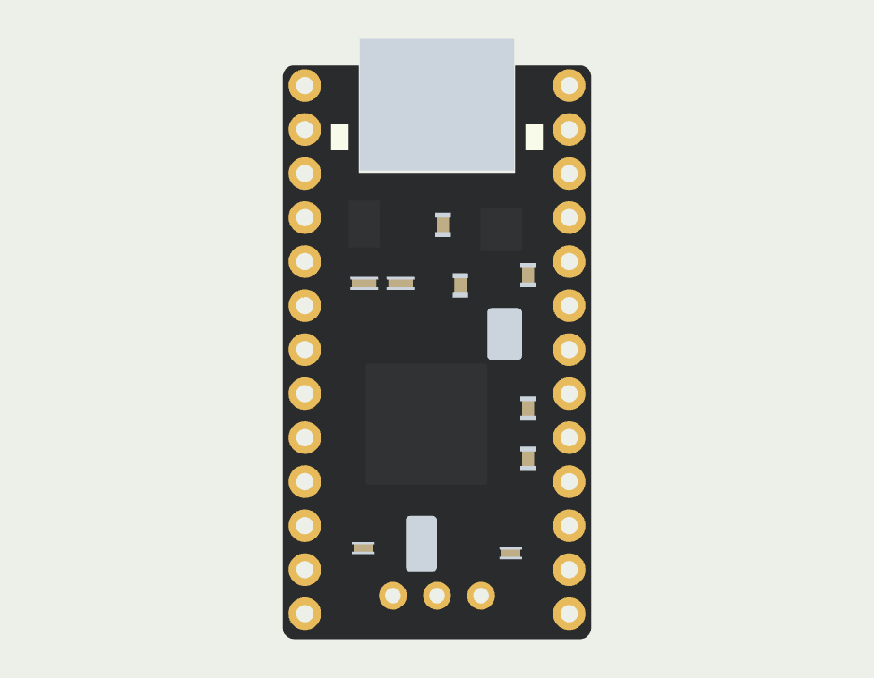

# Component models

These models make the assembly easier to inspect. They are **nominal representations**, not a claim of measured fit or manufacturer CAD.

| Part | Geometry and appearance | Evidence / remaining limit |
| --- | --- | --- |
| nice!nano v2 | Black rounded PCB, ENIG contacts, mid-mount USB-C shell and tongue, separate ICs, crystals, passives and LEDs | Official identity, 3.2 mm overall thickness and mid-mount USB. PCB 17.78 × 33.1 mm and total length 34.624 mm use a community drawing. Individual package placement/heights are reconstructed from photographs. |
| nice!view | 14 × 36 × 2.9 mm stack, five contacts, glass and backing; 10.744 × 25.28 mm active image | Official module drawing and Sharp panel specification. Preserve the 14.2 × 36.2 mm V-cut reserve for fit. Glass/flex assembly positions remain nominal. |
| Choc v1 | KiSwitch housing, pins and moving stem; original geometry, recolored | Generic Choc v1 community CAD; not a measured Pro Red specimen. KLP insertion and travel are not physically verified. |
| PCM12 / TL3342 | KiCad STEP geometry and original face materials | Registered to the existing KiCad footprints. Library models, not toleranced manufacturer assemblies. |
| Choc hotswap socket | Licensed source CAD is included for inspection | Assembly datum and floor clearance remain unqualified; it is not silently placed using its bounding-box center. |
| Batteries, battery connector, MCU sockets and leads | Existing dimensional reserves | Finished pouch seams, contacts, solder, terminations and strain relief still require measurement. |

The right half uses the **same** commercial nano/display geometry, translated into place. The power switch is rotated to its footprint. Neither module is mirrored.

The controller support has scalloped upper ledges. These keep clear of a 1.05 mm radius reserve around the underside pads. They do not establish solder tolerance or retention force.

The nice!view PCB remains 8.8 mm above the main PCB in this study. The Typeractive connector publishes 7 mm installed height. **That connection is still unresolved**; the visual model does not stretch a pin to hide the difference.

## Sources

- [nice!nano product specifications](https://nicekeyboards.com/nice-nano/) and [official v2 pinout, both faces](https://nicekeyboards.com/docs/nice-nano/pinout-schematic/).
- [Jordan Banasik / Woovie nominal v2 drawing](https://github.com/Woovie/nicenano-v2-model/tree/88099bcecdf2b60a0ec73131b132a182da03302b), CC0. Used as a dimensional reference; no recolored Pro Micro model is used.
- [nice!view mechanical drawing](https://nicekeyboards.com/docs/nice-view/pinout-schematic/) and [Sharp LS011B7DH03 catalogue](https://global.sharp/products/device/catalog/pdf/sharp_device202109_e.pdf).
- [KiSwitch source revision](https://github.com/kiswitch/kiswitch/tree/aefcf65038d48d2666ff14530d482be3c350fa6e), under its [MIT option](sources/KiSwitch-MIT.txt).
- [KiCad library license and exception](https://www.kicad.org/libraries/license/). Imported STEP files are CC-BY-SA-4.0 with the library exception. Original colors are preserved; only placement changes.

Exact asset URLs, hashes and licenses: [sources.json](sources.json). Official photographs are references, not images relicensed by this project. Parametric reconstruction: [components.py](../tools/freecad/components.py).
