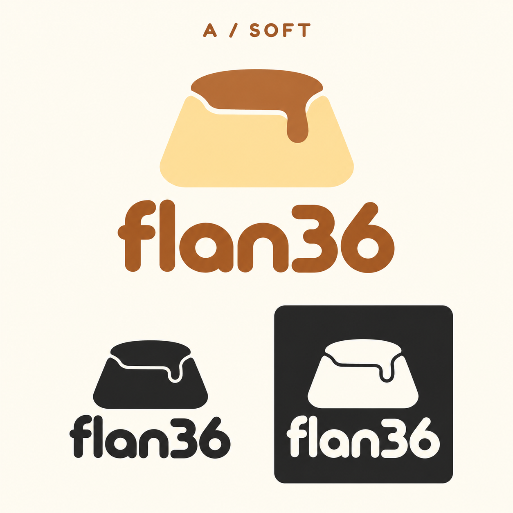
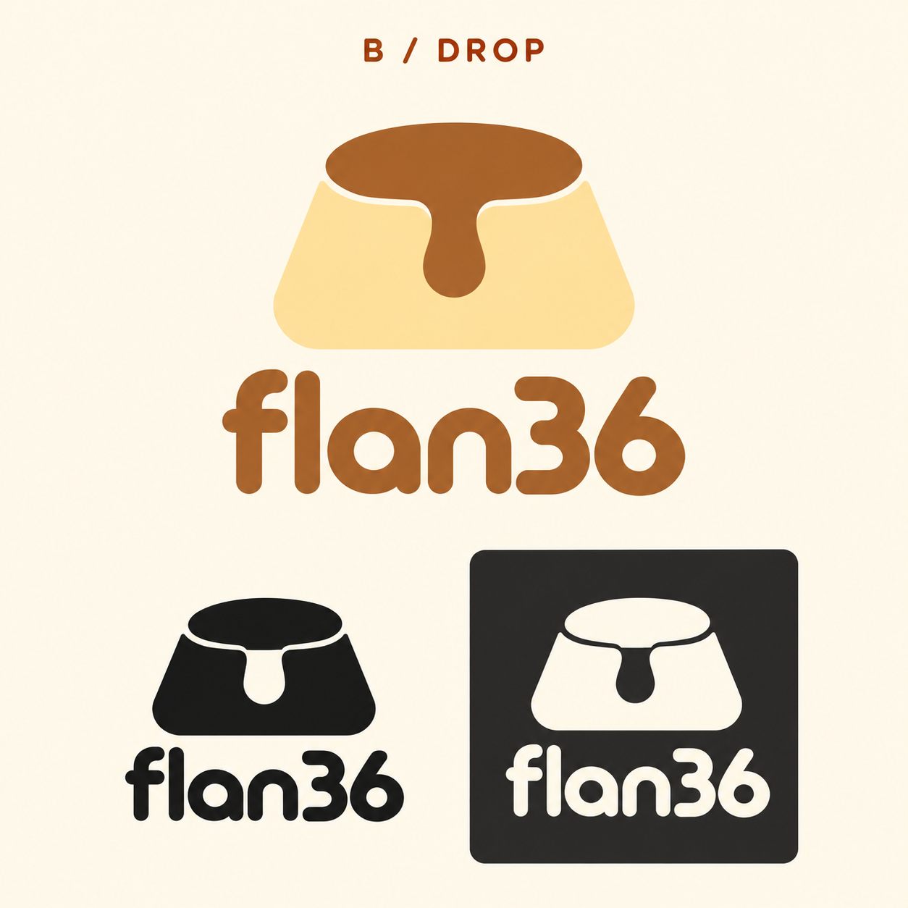
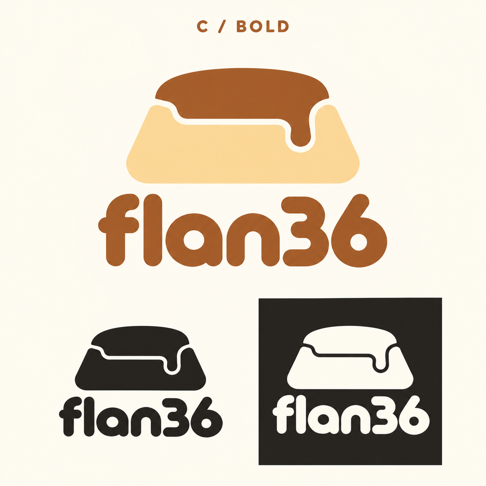
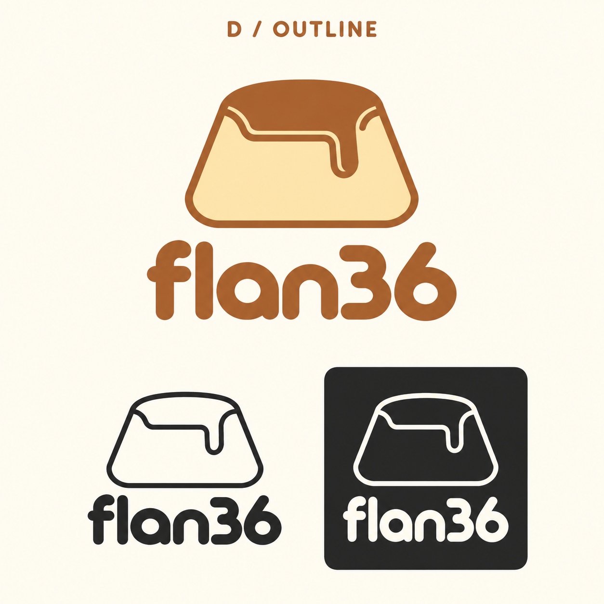
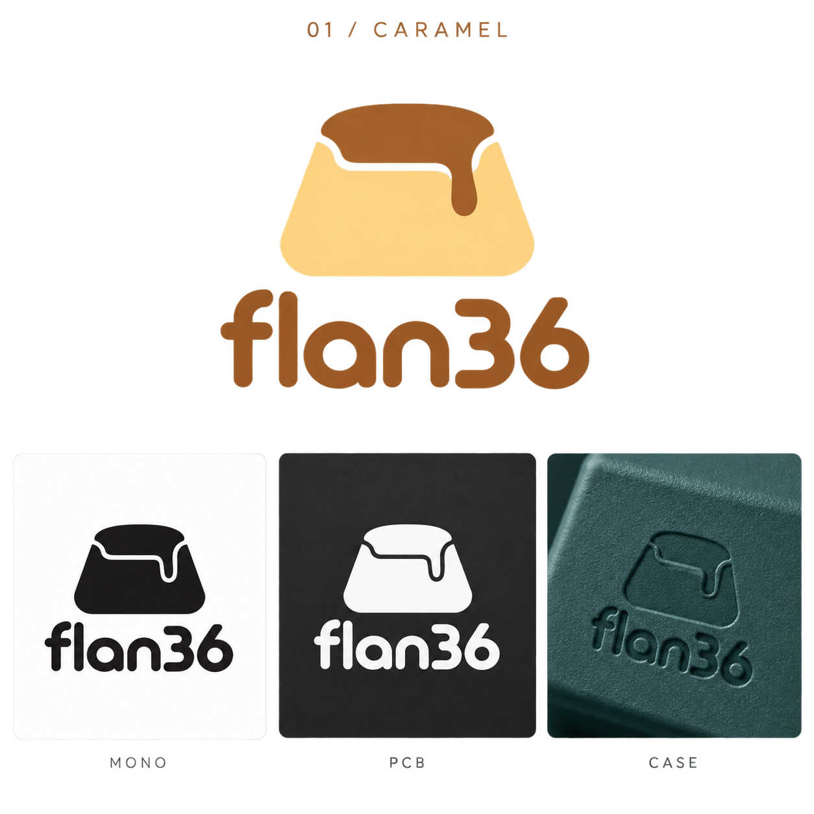
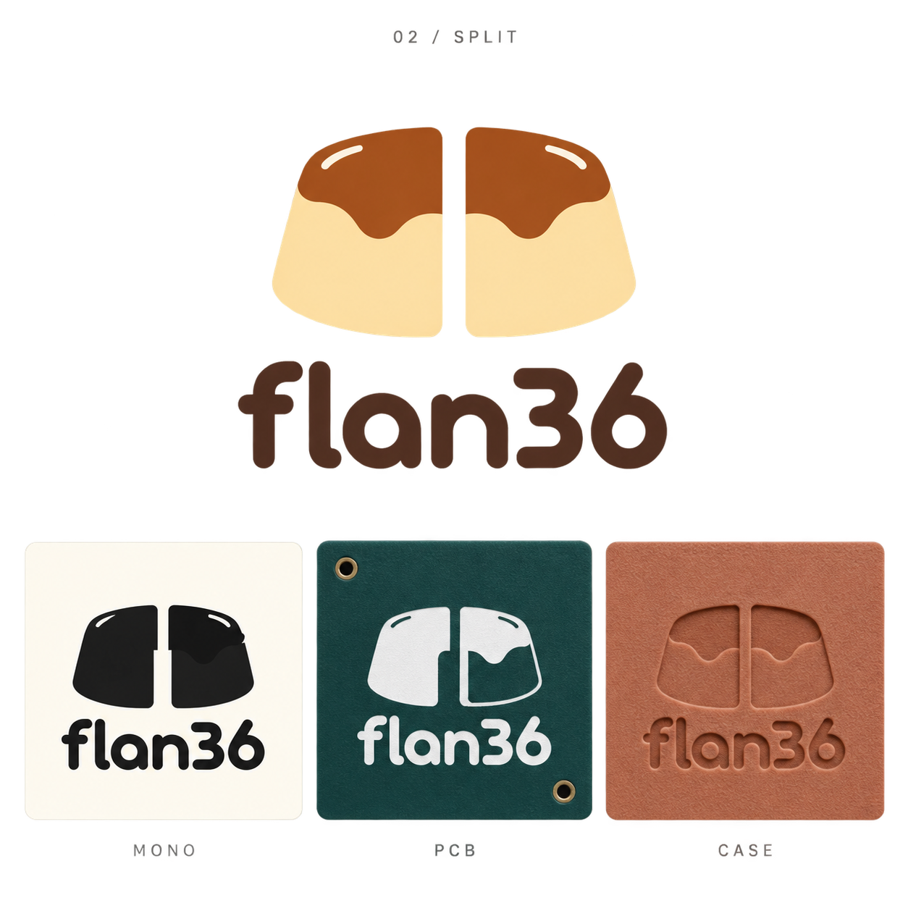
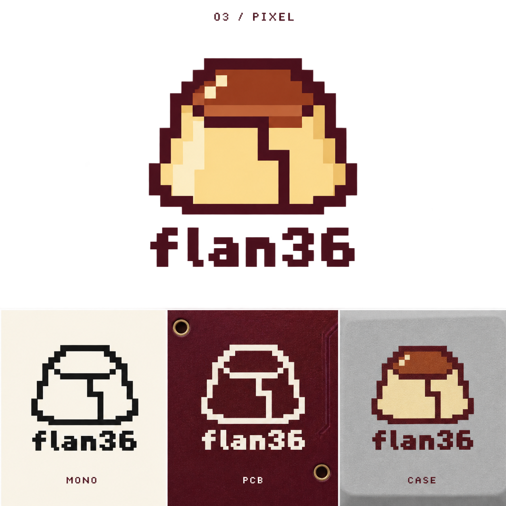

# Flan36 identity

**Flan36** is the selected name. The lowercase **flan36** wordmark pairs a Mexican dessert reference with the keyboard's 36 keys.

**[Open the visual gallery](https://eduarbo.github.io/filo36/branding.html)** · [3D explorer](https://eduarbo.github.io/filo36/)

## Caramel refinements

**D — Outline is the selected Flan36 logo.** It pairs an open flan contour with a solid lowercase wordmark. The other refinements remain here as design history.

### A — Soft

Closest to the original: soft shoulders, a shorter side drip and a quiet silhouette.

### B — Drop

A centered caramel drop and a balanced, symmetrical silhouette.

### C — Bold

A lower, wider shape, a short drip and a heavier wordmark.

### D — Outline · Selected

An open contour interpretation with a solid wordmark.

[Exact refinement prompts](../design/branding-caramel-prompts.json)

## Original directions

### 01 — Caramel

A soft flan silhouette with one caramel drip. The simplest direction for a small case signature.

### 02 — Split

Two halves form one flan. The most direct connection to the split keyboard.

### 03 — Pixel

A coarse pixel silhouette for Handheld, Retro TV and Cyberpunk themes.

## From concept to part

These PNG boards are **AI-generated identity concepts**, including illustrative PCB and case applications. They are not vector masters, measured CAD, PCB artwork or printable parts. Small differences between each board's color, monochrome and application samples must be resolved in the chosen vector master.

Create one closed-path SVG master from the selected Outline concept and derive the one-ink PCB mark and the case emboss/deboss from it. Check the PCB fabricator's silkscreen limits at the actual placement and size; keep clear of exposed pads, legends and holes. Check any case relief against its wall thickness, joining features and the chosen print process. The current case/PCB geometry has not been engraved or altered by this branding pass.

The existing repository URL, native `Filo36.FCStd` filenames, configuration schema and saved-browser-storage key remain stable for compatibility. The visible project name and new viewer downloads use Flan36. Historical render captions and validation receipts retain the name used when they were produced.

Generated with OpenAI's built-in image generation tool. [Exact prompts](../design/branding-prompts.json) · [Name and asset record](../design/branding.json) · [Credits](../ATTRIBUTION.md).
