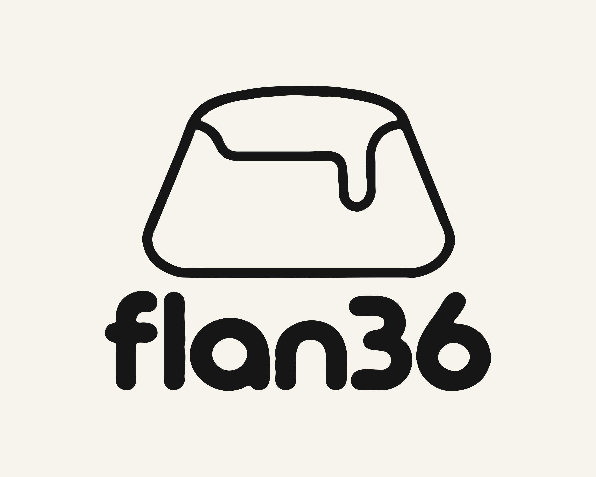

# Flan36 Outline

The selected logo: an open flan contour with a solid lowercase **flan36** wordmark.

**[View logo](https://eduarbo.github.io/flan36/branding.html)** · **[Download SVG kit](https://eduarbo.github.io/flan36/branding/outline/flan36-outline-svg-kit.zip)** · [Import guide](branding/outline/README.md)

The kit contains one editable master and three exports of the same logo: complete mark, symbol and lettering. All are closed paths with no font dependency. FreeCAD import and trial extrusion are checked; PCB placement and case relief remain pending.

The project's canonical repository is **[eduarbo/flan36](https://github.com/eduarbo/flan36)**. Current CAD, PCB files and new configuration exports use Flan36. Earlier configuration files remain importable. Previous design studies and original generation records remain historical provenance, outside this gallery.

[Credits](../ATTRIBUTION.md) · [Current asset record](../design/branding-outline-vectors.json)
