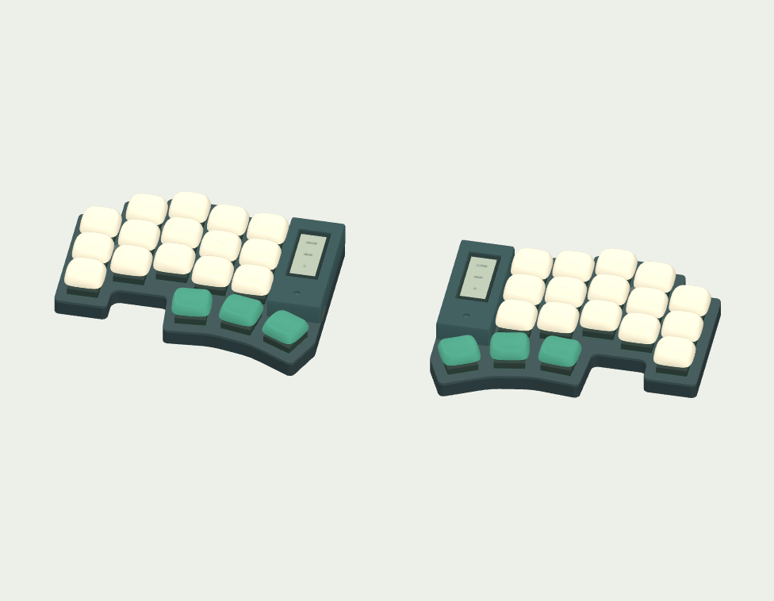
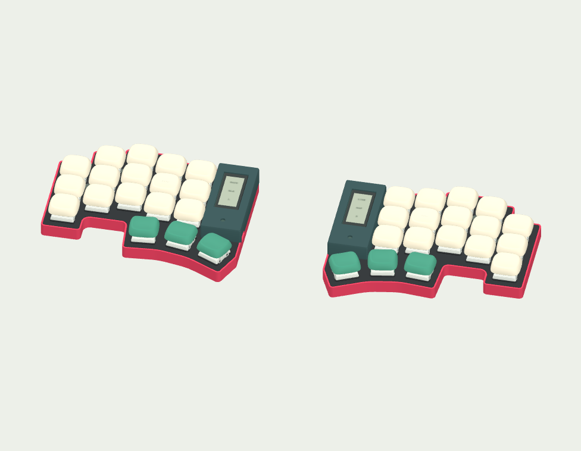
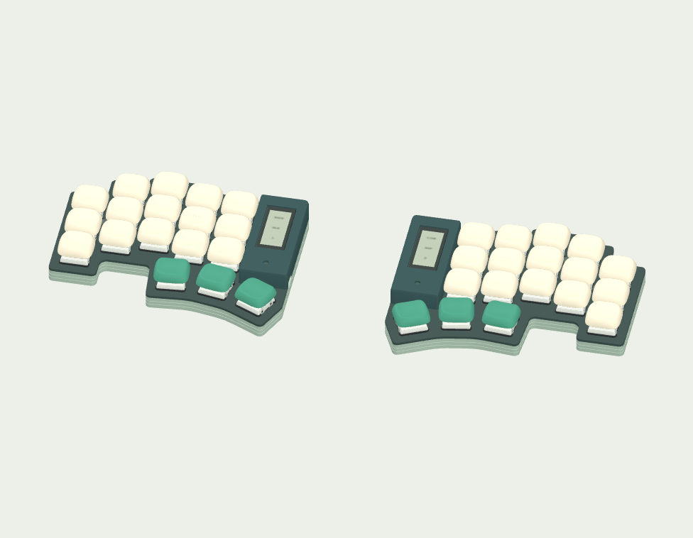
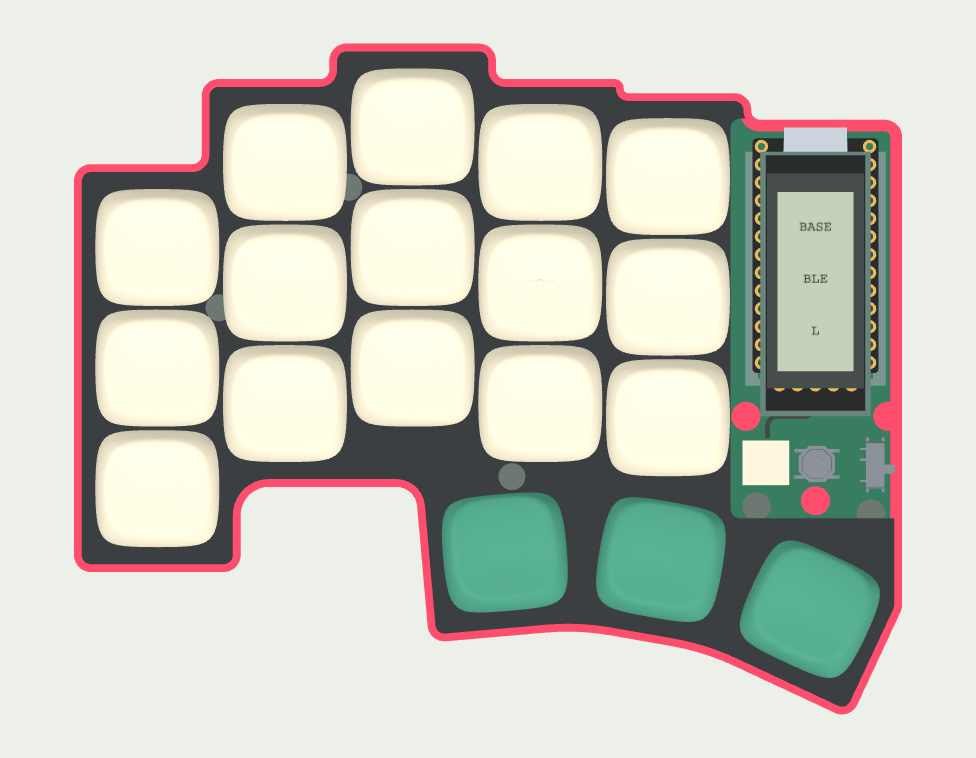

# Pick a case

[Open the 3D explorer](https://eduarbo.github.io/flan36/) → **Base** or **Plate** → choose a thumbnail. Apply a design to both halves or mix them.

| Solid | Color rim | Terrace |
|---|---|---|
|  |  |  |

| Design | Geometry | Suggested finish |
|---|---|---|
| **Solid** | Full plate over a continuous sidewall | Deep teal |
| **Color rim** | 0.9 mm wide rim flush with the plate, 1.1 mm plate inset, 0.2 mm joint | Red base + black plate |
| **Terrace** | Two 0.25 mm deep, 0.6 mm high recessed side bands | Sage base + dark plate |

All three follow the same Piantor key positions. Straight thumb faces stay parallel to their keys; tangent arcs soften their joins. Finger corners use up to R2.4, reduced locally at short steps. The pinky backbone remains 90°. No screw adds an outward bulge, and the thumb flank stays within the display-panel edge.

The shared outline is **116.75 × 94.57 mm per half**. Its 4.75 mm straight-face allowance protects the existing pads on both boards. The Color rim changes the visible plate edge without reducing that PCB budget. Terrace leaves at least 1.05 mm nominal sidewall away from intentional service openings; the 1.4 mm floor stays unchanged.

## Open or covered

Uncheck **Printed display cover** to expose the current stack. The display, controller, battery and structural supports remain; the printed cover and its three steel targets are omitted. Choose any display frame to reinstall it. This is the wireless nice!nano/nice!view stack, not the Raspberry Pi Pico arrangement in the inspiration photo.

**Eye / Solo** only change visibility. **Printed display cover** changes the saved assembly. Both choices are reversible, but only the assembly choice affects exported GLB and FreeCAD configuration.

## Edit and print

Download [Flan36.FCStd](../mechanical/revI/Flan36.FCStd) and use the [FreeCAD guide](freecad.md). `ActiveTray` and `ActivePlate` link to native `Case_solid`, `Case_rim` or `Case_terrace` bodies. Edit their source sketches and boolean operations under **Construction**. No custom Python proxy is needed to reopen the document.

[All case parts](../mechanical/revI) use `left-case-{solid,rim,terrace}-{base,plate}.{step,stl}` and matching `right-` names. Exported parts retain assembly coordinates. The viewer saves per-half case and cover choices in JSON; import that JSON with the configuration macro. Older JSON defaults to Solid with covers installed. The assembled GLB includes the selected meshes, including when view layers are hidden.

Print the base and plate separately for contrasting colors; a multicolor printer is optional. Use the existing [fit coupons and rebuilding commands](cad.md) before a full shell. The raised rim and recessed bands are real geometry. Nominal CAD checks do not qualify their printed strength, snap or thread fit, magnetic holding force or actual electronics clearances.
