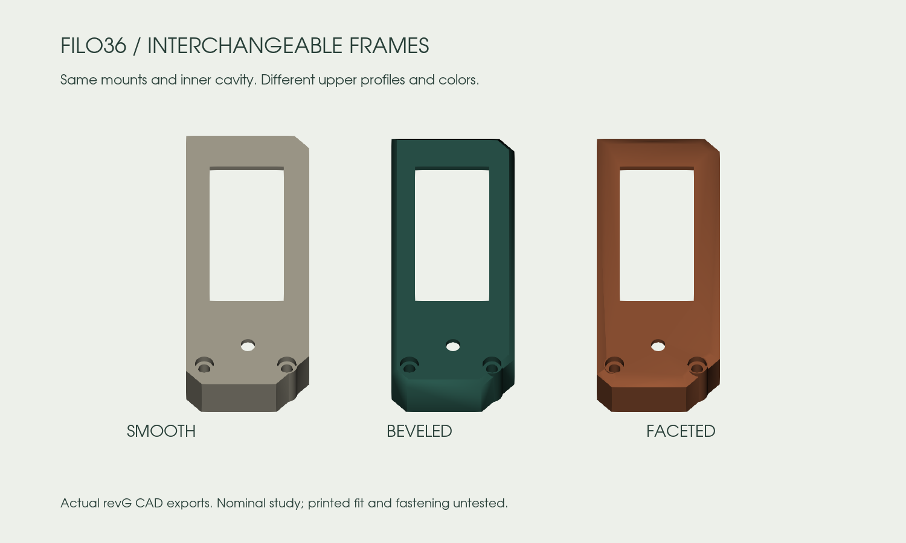

# Choose your keycaps and frames

Open the **[3D configurator](https://eduarbo.github.io/filo36/)**. No account or paid software is required.

## KLP Lamé

Choose a preset, a row, all thumbs or one key. Select a variant and rotation, then **Apply to these keys**. Each change checks the complete configuration, including neighboring keycaps and the frame.

| Choc-stem family | Files | Qualified reference positions |
|---|---:|---|
| Choc-size 1U | 7 | All 36 keys, at 0° or 180° |
| Choc-size 1U, 90deg stems | 7 | Thumbs only, at 90° or 270° |
| MX-size 1U, standard stems | 7 | Thumbs only, at 0° or 180° |
| MX-size 1U, 90deg stems | 7 | Thumbs only, at 90° or 270° |
| Choc-size and MX-size 1.5U | 10 | None qualified with the reference neighbors |

The seven 1U profiles are **Normal, Normal Homing, Normal Tilted, Saddle, Saddle Homing, Saddle Tilted and Thumb**. Each size also includes 1.5U Normal, Saddle H/V and Thumb H/V.

**MX size describes the keycap body, not its stem.** Every file in this catalog has Choc stems. MX-stem files are incompatible with the selected switches and are excluded. A `90deg` file rotates the stems inside the cap; the whole cap must then rotate 90° or 270° to match the unchanged switch. Actual stem geometry, rather than the H/V filename alone, determines allowed orientation.

The full [catalog](../keycaps/catalog.json) includes all 38 files and their source hashes. Unsupported 1.5U files remain available for study, but the configurator does not enable them. Failed conservative qualification is not proof that every possible physical arrangement is impossible.

The check uses unchanged STL convex envelopes with **at least 0.20 mm XY clearance**. Clear envelopes remain separate throughout independent vertical motion. A **3.5 mm travel study** keeps the complete cap mesh at least 0.6 mm above the plate, using an illustrative common stem-tip height of 11.7 mm. This does **not** prove real seating, switch travel or printed stem fit. Tilted caps are seated from their stem tips, rather than given the same arbitrary mesh origin as flat caps.

For the lowest profile, start with the flat variants. At the common nominal seating datum, Choc-size Normal/Thumb tops reach **17.87 mm**, Saddle **17.78 mm**, and Tilted variants **21.34 mm**, before feet. Tilted caps therefore add about **3.5 mm** locally; their comfort and final seated height need a physical trial.

Presets: **Original**, **Sculpted Normal** and **Sculpted Saddle**. The sculpted presets use tilted upper/lower rows in opposite orientations; they are starting points for comfort trials, not an ergonomic prescription.

## Display frames

RevF’s rails were exposed outer cover members. They did not hold the display: the independent **display sled** underneath does that.

RevG replaces them with opaque covers, each with a screen window, skirt, USB opening, power-switch access and a reset-tool hole. Choose **Smooth**, **Beveled** or **Faceted**, and set each half’s color. They share the same two rear M2 mounting centers and the same internal cavity. No PCB or key-position change is required to select a style.

| Parameter | Reference |
|---|---:|
| Maximum footprint | 24 mm bay; existing revF outline |
| Top above the case floor datum | 16.6 mm |
| Roof thickness | 1.2 mm |
| Side wall before upper bevel | 1.2 mm |
| Clearance around the glass | 0.4 mm per side |
| Screw passage / head recess diameter | 2.3 / 3.7 mm |

The rear mounting columns and head seats extend higher than revF’s open rails: **do not reuse a screw length without measuring it**. M2 thread engagement, head profile and printed hole fit remain provisional. The reset opening is for a tool, not a finger. A nominal 12 × 5 mm USB plug envelope and straight insertion corridor clear all styles; oversized cable housings may not.

For a custom frame, open the native source and expand **Construction**. Each style has three section sketches and a ruled loft, followed by the shared clearance cuts. Duplicate a style, edit its upper outline or add a surface pattern, retain the inner cavity and mounting interface, then check intersections. Imported outline segments use Block constraints; remove only the constraints on segments you intend to edit before moving their points. Keep the display window and service openings unobstructed. The delivered viewer accepts the three supplied geometries; a new shape must be exported and rebuilt into the viewer.

## Save a configuration for FreeCAD

1. In the viewer, choose caps, rotations, frame styles and colors.
2. Click **Save configuration** to download `Filo36-config.json`.
3. Download and unzip the full repository. Open `mechanical/revG/Filo36.FCStd` in FreeCAD.
4. Use **Macro → Macros → Execute** on `tools/freecad/Configure.FCMacro`. Keep the macro beside its companion files in the repository.
5. Choose **Import viewer configuration**, select the JSON and use **Save As**.

The macro changes the actual keycap meshes, placements and frame links. It validates the JSON before applying it and preserves other mechanical parameters. Its export action writes the same configuration format back to the viewer. Invalid choices are rejected without replacing the current configuration.

The JSON stores selections, not arbitrary FreeCAD shape edits. If you change wall geometry, PCB placement or other dimensions, keep the edited FCStd and recheck the assembly; loading JSON alone does not transfer those changes. [Editing guide](freecad.md).

KLP Lamé by braindefender, CC-BY-SA-4.0, pinned to commit `4a67a824232d3054c61599ea047c56a340faaba2`. Meshes are unchanged. [Upstream files and guidance](https://github.com/braindefender/KLP-Lame-Keycaps).
