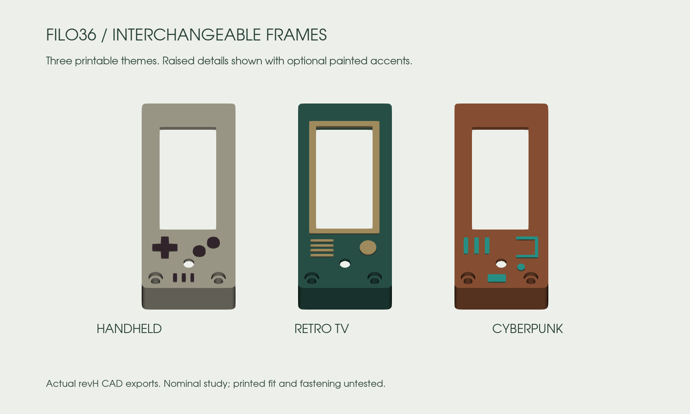

# Choose your keycaps and frames

Open the **[3D configurator](https://eduarbo.github.io/filo36/)**. No account or paid software is required.

## KLP Lamé

Open **Caps** in the directory, then click a preset preview to apply a complete set. Open **Edit keys** to choose a row, all thumbs or one key. Select a variant and rotation, then **Apply to these keys**. Each change checks the complete configuration, including neighboring keycaps and the frame.

| Choc-stem family | Files | Qualified reference positions |
|---|---:|---|
| Choc-size 1U | 7 | All 36 keys, at 0° or 180° |
| Choc-size 1U, 90deg stems | 7 | Thumbs only, at 90° or 270° |
| MX-size 1U, standard stems | 7 | Thumbs only, at 0° or 180° |
| MX-size 1U, 90deg stems | 7 | Thumbs only, at 90° or 270° |
| Choc-size and MX-size 1.5U | 10 | None qualified with the reference neighbors |

The seven 1U profiles are **Normal, Normal Homing, Normal Tilted, Saddle, Saddle Homing, Saddle Tilted and Thumb**. Each size also includes 1.5U Normal, Saddle H/V and Thumb H/V.

**MX size describes the keycap body, not its stem.** Every file in this catalog has Choc stems. MX-stem files are incompatible with the selected switches and are excluded. A `90deg` file rotates the stems inside the cap; the whole cap must then rotate 90° or 270° to match the unchanged switch. Actual stem geometry, rather than the H/V filename alone, determines allowed orientation.

The full [catalog](../keycaps/catalog.json) includes all 38 files and their source hashes. Unsupported 1.5U files remain available for study, but the configurator does not enable them. Failed conservative qualification is not proof that every possible physical arrangement is impossible.

The check uses unchanged STL convex envelopes with **at least 0.20 mm XY clearance**. Clear envelopes remain separate throughout independent vertical motion. A **3.5 mm travel study** keeps the complete cap mesh at least 0.6 mm above the plate, using an illustrative common stem-tip height of 11.7 mm. This does **not** prove real seating, switch travel or printed stem fit. Tilted caps are seated from their stem tips, rather than given the same arbitrary mesh origin as flat caps.

For the lowest profile, start with the flat variants. At the common nominal seating datum, Choc-size Normal/Thumb tops reach **17.87 mm**, Saddle **17.78 mm**, and Tilted variants **21.34 mm**, before feet. Tilted caps therefore add about **3.5 mm** locally; their comfort and final seated height need a physical trial.

Presets: **Original**, **Sculpted Normal** and **Sculpted Saddle**. The sculpted presets use tilted upper/lower rows in opposite orientations; they are starting points for comfort trials, not an ergonomic prescription.

## Print a themed display frame

Open **Frame** in the directory, then choose Both halves, Left or Right, then click a theme thumbnail to apply it immediately. The previews use the actual printable meshes. Shape changes preserve each half’s color; swatches change the finish separately. You can also select the frame directly on the model to open its sidebar options for that half.

| Theme | Printed details |
|---|---|
| **Handheld** | Game Boy-inspired D-pad, two buttons and speaker bars |
| **Retro TV** | Raised CRT-style bezel, tuning knob and speaker grille around the real portrait display |
| **Cyberpunk** | Raised panel, vents, traces and a small node |
| Plain options | Smooth, Beveled and Faceted |

The controls are decorative. No logos, extra switches or LEDs are required. All six styles use the same window, cavity, two M2 mounting centers and independent display support. Each exports as one closed solid per half. Relief stays within the 24 mm bay, without antennas or side wings.

| Interface | Nominal dimension |
|---|---:|
| Frame envelope | 24 × 56 mm; 1.2 mm plan-view corner radius |
| Plain top / themed relief top | 16.6 / 17.2 mm above the base datum |
| Structural roof / side wall | 1.2 / 1.2 mm |
| Glass margin, each side | 0.4 mm |
| Screw passage / head recess diameter | 2.3 / 3.7 mm |
| Relief height | 0.6 mm; fused into the roof |

The frame ends before the thumb key; the **low case and plate continue along the straight flank**. The existing power-switch reference projects 1.5 mm outside the case for access. Key positions and electronics placement remain fixed.

### Make your own

Open the native source and expand **Construction**. Duplicate a supplied theme, then edit the `Theme_*` boxes/cylinders or the frame section sketches. Preserve the cavity, mounting bosses, screen window and service cuts. The case outline is a native sketch with **16 intentional corners and analytical R1.2 arcs**; mesh tessellation does not add design corners. Remove only the Block constraints you intend to edit.

Keep decorations within the common envelope. Avoid the screw centers at left **(114.5, 64)** and **(130.6, 64)**, the reset tool opening at **(123, 59.5)**, and the glass window. Right-half coordinates mirror across X=80 mm. Relief adds material above the roof; cutting through it changes the validated wall thickness.

Use the viewer’s JSON for the six supplied shapes. To share a new shape, save your FCStd, export STEP/STL, rebuild the viewer and repeat collision checks; JSON alone cannot carry arbitrary geometry.

### First print

Start with **one frame in PLA Basic** as a fit sample. Use 0.16 mm layers as a starting point so the 0.6 mm relief is visible; inspect it in the slicer. Face-up protects the visible details but the roof/inside may need supports. PETG HF is an alternative to compare after the fit sample; ABS requires shrinkage compensation from an actual print. No material-specific tolerance has been qualified yet.

For contrasting accents, paint raised faces in the slicer if your printer setup supports multiple colors, or paint them after printing. No multi-material hardware is assumed. These are one-piece frames, not a snap-fit kit of separate colored buttons.

Screw length, head fit, print orientation and extraction clearance still require a physical trial. The reset opening takes a tool. A nominal 12 × 5 mm USB plug and straight insertion corridor clear each theme; cable housings vary.

## Save a configuration for FreeCAD

1. In the viewer, choose caps, rotations, frame styles and colors.
2. Open **Files** and click **Save configuration** to download `Filo36-config.json`.
3. Download and unzip the full repository. Open `mechanical/revH/Filo36.FCStd` in FreeCAD.
4. Use **Macro → Macros → Execute** on `tools/freecad/Configure.FCMacro`. Keep the macro beside its companion files in the repository.
5. Choose **Import viewer configuration**, select the JSON and use **Save As**.

The macro changes the actual keycap meshes, placements and frame links. It validates the JSON before applying it and preserves other mechanical parameters. Its export action writes the same configuration format back to the viewer. Invalid choices are rejected without replacing the current configuration.

The JSON stores selections, not arbitrary FreeCAD shape edits. If you change wall geometry, PCB placement or other dimensions, keep the edited FCStd and recheck the assembly; loading JSON alone does not transfer those changes. [Editing guide](freecad.md).

KLP Lamé by braindefender, CC-BY-SA-4.0, pinned to commit `4a67a824232d3054c61599ea047c56a340faaba2`. Meshes are unchanged. [Upstream files and guidance](https://github.com/braindefender/KLP-Lame-Keycaps).
