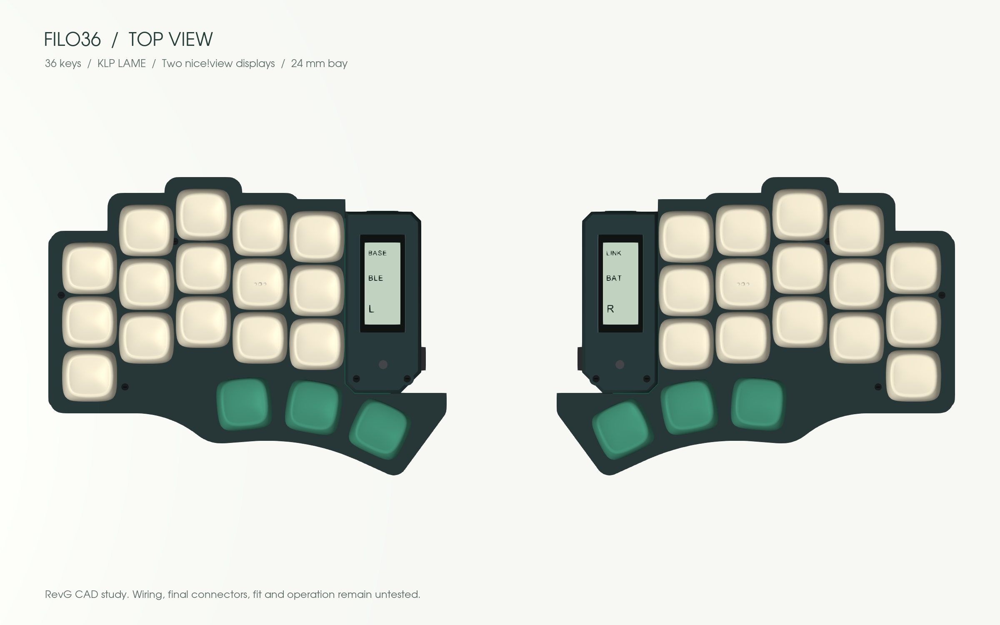
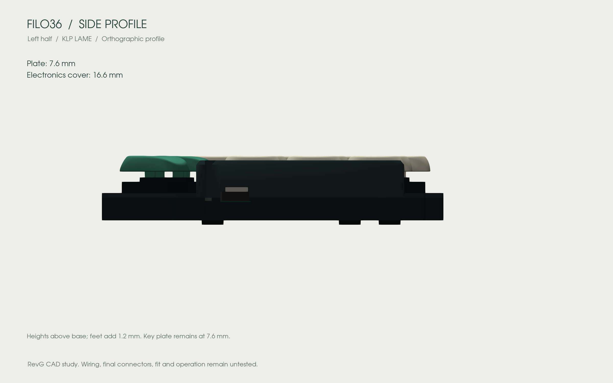
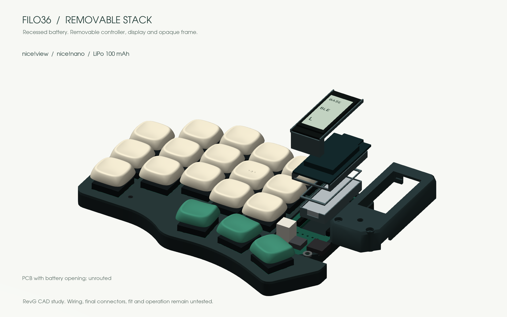

# Design

Keep Piantor’s angles, a thin key area and serviceable electronics.

| Choice | Reason |
|---|---|
| 3 × 5 + 3 keys per half | Remove the unused outer column without changing the remaining centers or angles |
| Choc v1 hot-swap | Low-profile, replaceable switches |
| Two nice!nano controllers, intended ZMK firmware | Wireless halves and host connection; USB-C for charging/programming |
| Battery below controller, display above | Concentrate electronics in the existing 24 mm bay |
| Independent internal supports | Neither the battery pouch nor display glass carries the stack |
| Interchangeable opaque display frames | Hide the stack and customize its appearance without moving keys |

## The stack

The battery cradle sits through an actual PCB opening. The controller and display have separate supports above it. The model uses an Adafruit 1570 nominal envelope of **11.5 × 31 × 3.8 mm**. Its original cable and connector still need a verified routing path. [Battery source and alternatives](parts.md#battery).

The current case is about **126.2 × 94.5 mm per half**; the thumb positions still determine much of its width. The key plate stays at **7.6 mm**, with only the electronics cover reaching **16.6 mm**. Feet add an illustrative 1.2 mm.

The earlier wide side-by-side layout was discarded. RevF introduced the recessed battery and open rails; revG keeps that placement but replaces the rails with opaque covers. [Frame interface and KLP options](customize.md).

## One or two displays

The CAD shows two nice!view displays; one on the left remains the fallback if integration becomes impractical. The intended central display shows primary keyboard state. A peripheral display may show its own battery/link state; mirrored layer information is not promised. [nice!view setup](https://nicekeyboards.com/docs/nice-view/getting-started/).

nice!view is a reflective memory LCD. OLED improves dark-room visibility but uses more power; e-paper favors mostly static images and needs different mounting and firmware. These are alternatives to redesign around, not drop-in replacements. [Display specifications](https://nicekeyboards.com/docs/nice-view/).

## Modularity

Switch sockets, removable controller/display connectors, a battery connector and screws allow servicing after initial soldering. The frames are separate from the display support. Service electronics with power off and USB disconnected; removable connectors are not a proposal for live module hot-plugging.

## CAD views

These views come from the exported geometry. Electronics, switch bodies, keycap seating, screws and feet are nominal references. No physical assembly or functioning keyboard is established by the renders. [Source files and remaining work](cad.md).
