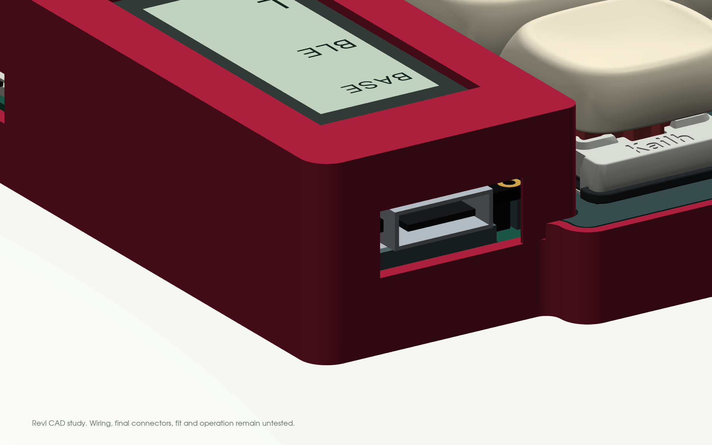
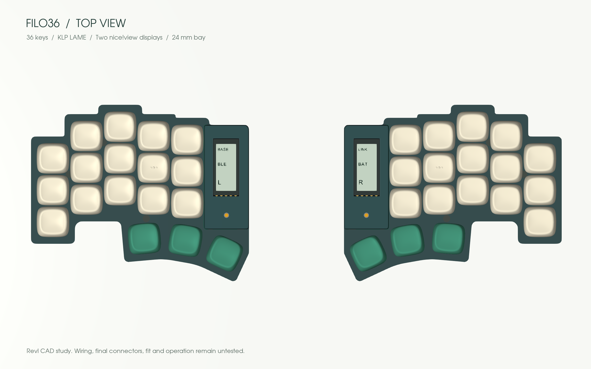
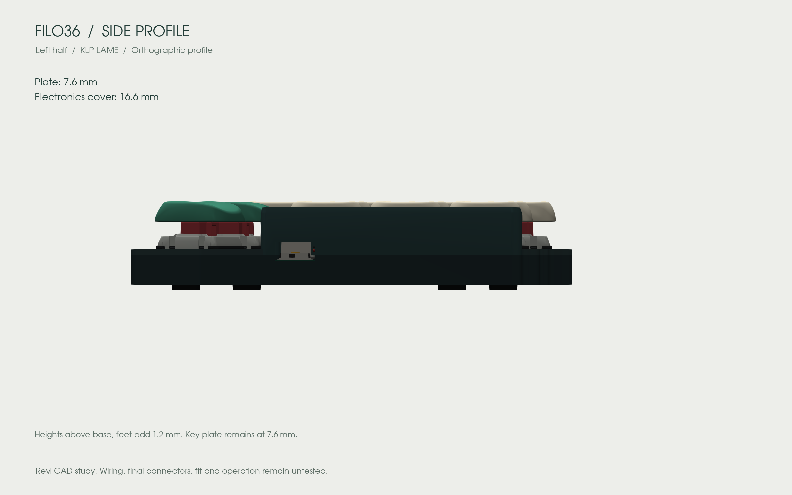
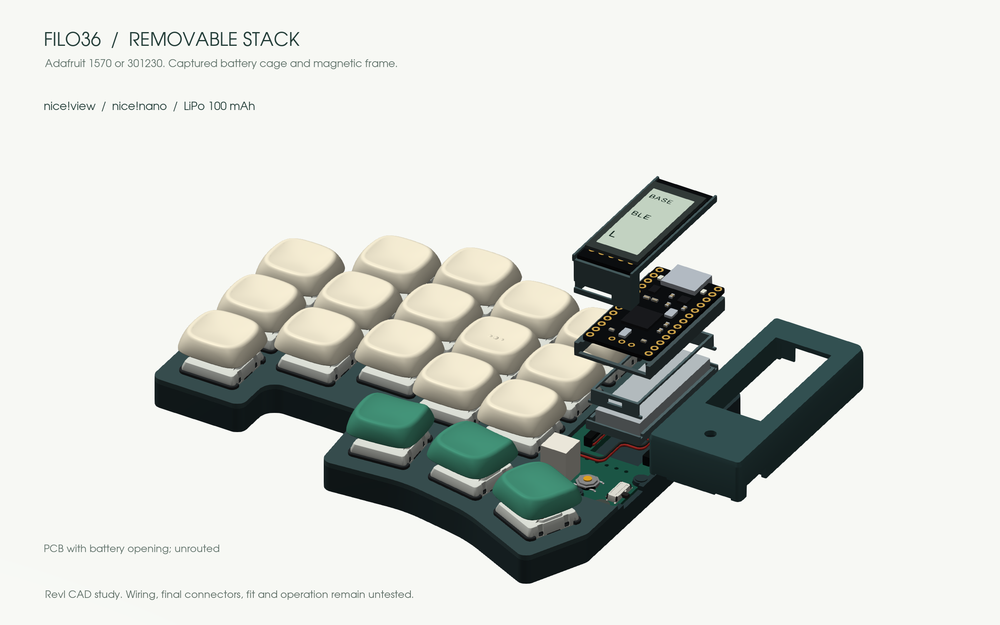

# Design

Keep Piantor’s angles, a thin key area and serviceable electronics.

| Choice | Reason |
|---|---|
| 3 × 5 + 3 keys per half | Remove the unused outer column without changing the remaining centers or angles |
| Choc v1 hot-swap | Low-profile, replaceable switches |
| Two nice!nano controllers, intended ZMK firmware | Wireless halves and host connection; USB-C for charging/programming |
| Battery below controller, display above | Concentrate electronics in the existing 24 mm bay |
| Independent internal supports | Neither the battery pouch nor display glass carries the stack |
| Interchangeable opaque display frames | Hide the stack and customize its appearance without moving keys |

## The stack

The insulating saddle stays below the PCB. The cell and a narrow removable cage pass through a **12.5 × 33.6 mm opening**. One cavity accepts the nominal Adafruit 1570 and 301230 envelopes; select either in the viewer or FreeCAD. The model reserves two 105 mm lead paths, but actual terminal positions, wire diameter and strain relief still need measurement. [Battery dimensions and sources](parts.md#battery).

The case is **116.75 × 94.57 mm per half**. Five stepped column tops, an orthogonal pinky foot and a shallow rounded recess follow the reference. Straight lower faces remain parallel to each thumb key, joined by **local tangent arcs**. The outside thumb flank stops at the LCD panel edge. The 21 control corners use locally bounded radii, including R2.4 finger corners where space permits. Straight exposed faces retain their **4.75 mm** copper allowance. Fasteners stay within existing material. Both halves are exact mirrors; all 36 switch centers and angles remain unchanged.

Choose [Solid, Color rim or Terrace](cases.md). These are different base/plate geometries, compatible with the same stack and six display frames. The printed display cover can be omitted while retaining the display and structural supports.

The key plate stays at **7.6 mm**, plain frames at **16.6 mm**, themed relief at **17.2 mm**. The electronics bay remains **24 mm wide**; illustrative feet add 1.2 mm. The frame ends at Y=67 mm while the low base/plate continue to the thumb. The power-switch reference is now recessed 0.1 mm inside the straight X=135 mm flank.

The frame now shares the case's **R2.4 north/outside corner** beside USB, including its tangency points. The former independent R1.2 frame corner projected about **0.497 mm** beyond that curve. The cavity, plate clearance and beveled lips follow the corrected corner; the case and PCB outlines stay unchanged.

### Can the stack be thinner?

**The current height is not a proven minimum.** Dimensions below start at the bottom of the case, excluding feet and keycaps.

| Configuration | Plain cover | Raised themed cover | Status |
|---|---:|---:|---|
| Current model | 16.6 mm | 17.2 mm | Published nominal assembly |
| Lower display candidate | 15.6 mm | 16.2 mm | Preliminary nominal study; not selected for printing |
| Full 1.8 mm reduction | 14.8 mm | 15.4 mm | Rejected with the current battery connector envelope |

The display PCB currently sits 8.8 mm above the main PCB. [Typeractive's 5-pin connector](https://typeractive.xyz/products/5-pin-sockets) is described as 7 mm installed, suggesting a display-bottom candidate of **12.4 mm** instead of 14.2 mm. That interpretation still needs a measured mounting datum and qualified pin engagement.

The left-half study at 15.6 mm finds no intersections in the affected nominal component/frame pairs, with **0.82 mm** between the modeled MCU and display and **0.5 mm** above the battery connector. At 14.8 mm, the roof cuts **0.3 mm** into that connector envelope in every frame style. The connector is still an approximate block, so these numbers identify constraints, not final tolerances. [Reproducible study](../tools/freecad/study_stack_height.py) · [Measured results](../validation/revI-stack-study.json).

The Adafruit battery controls the required cell height (3.8 mm); the 301230 controls width (12 mm). Both remain supported. Final compactness depends on the actual sockets, solder, display backing, battery connector, leads and removable supports. The lower candidate has not passed connector engagement, extraction paths or physical fit; the printable source retains its current height.

### Magnetic frame, independent structure

Three captive **Ø2 × 3 mm magnets** in the base attract three captive **Ø2 × 4 mm steel pins** in each frame. Shallow guides locate the cover; it lifts vertically. The frame carries no battery or display load. Five internal M2 fasteners per half retain the plate/PCB independently, with no added perimeter lobes. Three use 6 mm shafts; the two hidden under the frame use 4 mm shafts.

The inserts are enclosed by a pause-and-insert print sequence. Force through the nominal **0.9 mm gap**, north-edge peel, print capture and magnet temperature remain physical tests. [Assembly sequence and coupons](build.md#magnetic-frame-and-service).

## One or two displays

The CAD shows two nice!view displays; one on the left remains the fallback if integration becomes impractical. The intended central display shows primary keyboard state. A peripheral display may show its own battery/link state; mirrored layer information is not promised. [nice!view setup](https://nicekeyboards.com/docs/nice-view/getting-started/).

nice!view is a reflective memory LCD. OLED improves dark-room visibility but uses more power; e-paper favors mostly static images and needs different mounting and firmware. These are alternatives to redesign around, not drop-in replacements. [Display specifications](https://nicekeyboards.com/docs/nice-view/).

## Modularity

Switch sockets, removable controller/display connectors, a battery connector, magnetic covers and independent screws allow servicing after initial soldering. The frames are separate from the display support. Service electronics with power off and USB disconnected; removable connectors are not a proposal for live module hot-plugging.

## CAD views

These views come from the exported geometry. Electronics, switch bodies, keycap seating, screws and feet are nominal references. No physical assembly or functioning keyboard is established by the renders. [Source files and remaining work](cad.md).
