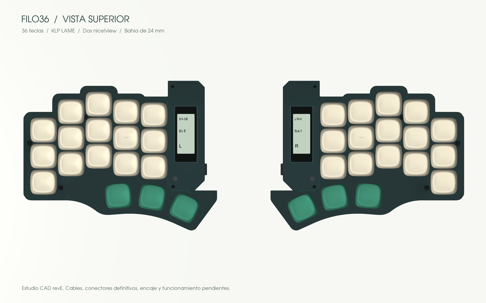
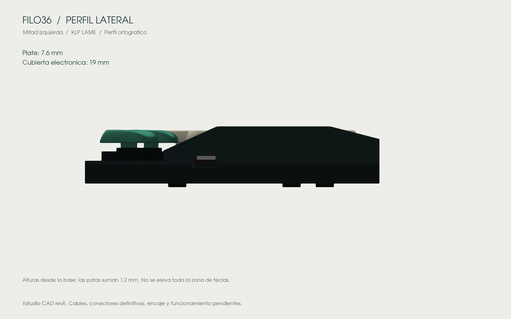
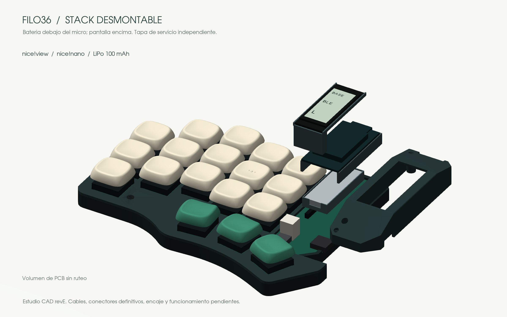

# Diseño

El objetivo es un split pequeño, angular y fácil de mantener. Reducir la electrónica no debe cambiar la posición de las teclas ni engordar toda la carcasa.

| Decisión | Motivo |
|---|---|
| 3 × 5 + 3 teclas por mitad | Se elimina la columna exterior; los otros centros y ángulos no cambian |
| Choc v1 hot-swap | Perfil bajo y switches reemplazables |
| Dos nice!nano v2 + ZMK | Bluetooth entre mitades y al equipo; USB-C para cargar y programar |
| Batería estrecha bajo el micro | Reduce el ancho de la bahía; aumenta la altura local de la electrónica |
| Pantalla sobre el micro | Evita añadir otra zona lateral |
| Tapa electrónica independiente | Acceso a los módulos sin desmontar las teclas |

## El stack en desarrollo

De abajo hacia arriba: PCB principal, cuna aislante con batería, micro socketado y pantalla extraíble. La batería no soporta el peso ni la presión de otros componentes.

El candidato es una LiPo protegida Adafruit 1570 de 100 mAh, de 11,5 × 31 × 3,8 mm. Su cable original de 105 mm y el conector también tienen que caber. El CAD actual tiene una bahía de **24 mm**, cubierta electrónica de **19 mm** y plate de **7,6 mm**. Son dimensiones del modelo; el cableado, tolerancias y ajuste de componentes recibidos siguen pendientes. La zona de teclas se mantiene baja.

La revisión anterior tenía una bahía de 33,52 mm y batería de 150 mAh situada a un lado del micro. Pasar a 100 mAh reduce la capacidad nominal un tercio. La autonomía todavía no está medida. El ancho máximo de cada mitad también depende del pulgar: estrechar la bahía no reduce necesariamente ese máximo en la misma cantidad.

## Una o dos pantallas

La propuesta usa dos nice!view. ZMK ya contempla pantalla central y periférica: la izquierda puede mostrar el estado principal; la derecha, batería y conexión propias. No se promete un espejo de capas en la derecha. Si integrar la segunda complica demasiado el montaje, la variante inicial llevará sólo la izquierda.

nice!view es una LCD reflectiva de memoria de bajo consumo. Una OLED ofrece más contraste en oscuridad, pero demanda más energía. La tinta electrónica consume poco manteniendo una imagen y actualiza más despacio; necesitaría otro montaje y soporte de firmware. Ninguna es intercambiable sin revisar circuito y carcasa.

## Qué significa modular

Switches en sockets, micro y pantalla en conectores extraíbles, batería con conector y carcasa atornillada. El montaje inicial sigue requiriendo soldar sockets y componentes de PCB. El mantenimiento de la electrónica se hace apagada, con USB retirado; no se propone conexión en caliente de los módulos.

Fuentes: [nice!nano](https://nicekeyboards.com/docs/nice-nano/), [nice!view](https://nicekeyboards.com/docs/nice-view/), [configuración de pantalla en ZMK](https://nicekeyboards.com/docs/nice-view/getting-started/), [batería 1570](https://www.adafruit.com/product/1570).

## Vistas del CAD

La bahía pasa de 33,52 a 24 mm. No cambian las posiciones ni las rotaciones de las teclas.

El stack ocupa altura local: 19 mm en la electrónica y 7,6 mm hasta el plate. Las patas añaden 1,2 mm en esta representación.

Batería debajo del micro, pantalla encima y tapa separada. La PCB es una envolvente sin ruteo y la electrónica usa volúmenes nominales; no son modelos de fabricación del proveedor. El cable original de batería, sus radios de curvatura, contactos y retención final aún no están resueltos. [Archivos y límites del estudio](cad.md).
