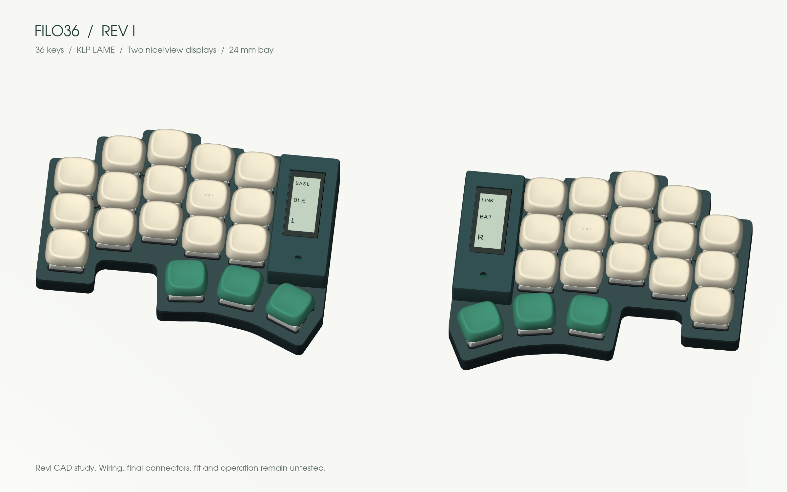

# Parts and buying guide

**One complete 36-key split. Quantities cover both halves.**

This is a planning BOM for the revI mechanical study and PCB outline. **It is not a verified build kit:** the PCBs are unrouted, and exact connectors, magnetic retention and printed threads still need physical tests. Store links identify actual products; they do not certify interchangeability.

[Typeractive shopping list](#typeractive-shopping-list) · [Controllers](#controllers) · [Displays](#displays) · [Switches](#switches-and-hot-swap) · [Battery](#battery) · [Connectors](#removable-connectors) · [Small parts](#small-electrical-parts) · [Printed parts](#printed-parts)

## Typeractive shopping list

| Item | Quantity / store selection | Fit status |
|---|---|---|
| [nice!nano v2](https://typeractive.xyz/products/nice-nano) | **2 units** | Selected controller; final socket height pending |
| [nice!view](https://typeractive.xyz/products/nice-view) | **2 units**, or 1 for the fallback | Selected display; included connector does not establish stack fit |
| [Choc v1 switches](https://typeractive.xyz/products/choc-switches) | **4 packs of 10**; Pro Red baseline | 36 required, 4 spares |
| [Kailh hot-swap sockets](https://typeractive.xyz/products/hotswap-sockets) | **4 packs of 10; select Choc** | Do not select MX |
| [1N4148W SMD diodes](https://typeractive.xyz/products/smd-diodes) | **4 packs of 10** | SOD-123 family; verify supplied marking/footprint |
| [Machine sockets and pins](https://typeractive.xyz/products/machine-sockets-and-pins) | **2 kits** | Store uses Mill-Max **310**, study references **315**; substitution needs height/pin check |
| [EZ-Solder sockets/headers](https://typeractive.xyz/products/ez-machine-sockets-and-headers) | **2 kits**, instead of the preceding kits | Easier header handling; taller, not qualified in this stack |
| [5-pin sockets](https://typeractive.xyz/products/5-pin-sockets) | Optional **1 pack of 2** | Extras; nice!view already includes sockets/pins. Published 7 mm installed height differs from our nominal stack |
| [110 mAh battery](https://typeractive.xyz/products/lithium-battery-110mah) | **2**, connector variant to resolve | Supported nominal envelope in the shared 12.5 mm aperture; physical pack fit pending |
| [Battery jack](https://typeractive.xyz/products/battery-jack) | **1 pack of 2** | JST S2B-PH-K reference; orientation/footprint not closed |
| [Power switch](https://typeractive.xyz/products/power-switch) | **1 pack of 2** | Alps part differs from the C&K reference; footprint change/check required |
| [Reset button](https://typeractive.xyz/products/reset-button) | **1 pack of 2** | Panasonic part differs from the E-Switch reference; not a drop-in approval |

The selected Adafruit battery, custom PCB and printed parts are outside this store list. Prices, stock and shipping eligibility can change; check the selected variant and delivery destination at checkout. No purchases have been made.

## Controllers

**2 × nice!nano v2.** nRF52840 wireless controllers with USB-C and battery charging. They provide the intended BLE link between halves and to the host.

**Technical reference:** [v2 pinout and schematic](https://nicekeyboards.com/docs/nice-nano/pinout-schematic/). **Full documentation:** [nice!nano](https://nicekeyboards.com/docs/nice-nano/). **Buy:** [Typeractive](https://typeractive.xyz/products/nice-nano).

Alternatives: clones require independent pinout, charger and idle-current checks. XIAO or other controller formats require a PCB and mounting redesign. No alternative is approved as a direct replacement.

## Displays

**2 × nice!view**, with a single left display as the fallback. Reflective memory LCD; selected for low power. Each cover leaves the glass visible and hides the surrounding electronics.

**Technical reference:** [dimensions, pinout and schematic](https://nicekeyboards.com/docs/nice-view/pinout-schematic/). **Full specifications/setup:** [nice!view documentation](https://nicekeyboards.com/docs/nice-view/). **Buy:** [Typeractive](https://typeractive.xyz/products/nice-view).

A separate board PDF datasheet is not linked by the manufacturer; its dimensioned drawings and schematic are the authoritative board references. OLED offers dark-room visibility at a power cost. E-paper needs a different mount and firmware. Neither fits this design as a drop-in alternative.

## Switches and hot-swap

**36 × Kailh Choc v1; 40 provides spares.** Pro Red 35 gf is the baseline; Pink 20 gf is lighter, Red 50 gf firmer, Brown tactile and White clicky. Silent Ambients are another Choc-family option to measure before adopting.

**Technical information:** [Kailh PG1350 family](https://www.kailhswitch.com/info/kailh-kl-switches-pg1350-series-23772219.html). **Variant specifications and purchase:** [Typeractive Choc v1](https://typeractive.xyz/products/choc-switches). **Silent alternative:** [LowproKB Ambients](https://lowprokb.ca/products/ambients-silent-choc-switches).

An exact Pro Red manufacturer PDF has not been verified here; the family page is not a substitute for a variant-specific drawing. Choc v2/MX-stem switches are outside this build.

**36 × Kailh CPG135001S30 Choc sockets; 40 provides spares.**

**Datasheet/drawing:** [Kailh CPG135001S30 PDF](https://www.kailhswitch.com/Content/upload/pdf/202115927/CPG135001S30-data-sheet.pdf). **Info and purchase:** [Typeractive — select Choc](https://typeractive.xyz/products/hotswap-sockets). The product photo includes both families; the **MX** variant is incompatible.

## Battery

**CAD reference: 2 × Adafruit 1570, protected 1S LiPo, sold as 100 mAh.** The model uses the product page’s **11.5 × 31 × 3.8 mm** envelope; two 105 mm lead storage paths are modeled as a nominal reservation.

**Datasheet:** [supplier-linked PKCELL PDF](https://cdn-shop.adafruit.com/product-files/1570/1570datasheet.pdf). **Full information and purchase:** [Adafruit 1570](https://www.adafruit.com/product/1570). The linked PDF names a **401230 / 105 mAh** cell, while the listing says 100 mAh: confirm the actual supplied pack and its dimensions before closing the cradle. The product page limits charging to **100 mA or less**; the nice!nano charger configuration must respect the actual cell’s limit.

**Typeractive alternative: 301230, 110 mAh, 3 × 12 × 30 mm.** [Product and connector variants](https://typeractive.xyz/products/lithium-battery-110mah). The black PH connector version has shorter leads; the white version includes a mating wired jack. No cell-specific datasheet is linked on the listing.

**Both profiles use the same case, PCB opening, cradle and cage.** Select the battery in **Battery** in the sidebar in the viewer; configuration JSON and FreeCAD retain the choice per half.

| Profile | Nominal W × L × H | Aperture side gap | Gap below rigid cage roof |
|---|---|---:|---:|
| Adafruit 1570 | 11.5 × 31 × 3.8 mm | 0.50 mm per side | 0.40 mm |
| 301230 | 12 × 30 × 3 mm | 0.25 mm per side | 1.20 mm |

These are nominal clearances, not maximum finished-pack tolerances. Confirm protection-board wrapping, insulation at PCB edges, lead exit, connector polarity and charging limits on the delivered pack. The smaller pack can move within the cage; its full translation envelope remains clear of the modeled leads. No autonomy estimate is promised.

## Removable connectors

**Controller study reference:** 4 × 12-position Mill-Max **315-43-112-41-003000** strips and 48 compatible round pins, plus spares. [Manufacturer-authored datasheet, distributor mirror](https://static6.arrow.com/aropdfconversion/2e225be7d9212620894362dafa7ce735623fe9ca/315-43-112-41-003000.pdf).

**Store alternative:** [Typeractive machine sockets/pins](https://typeractive.xyz/products/machine-sockets-and-pins), **2 kits**, each for one controller. The listing specifies Mill-Max **310**; do not treat it as the modeled 315 part. [EZ-Solder](https://typeractive.xyz/products/ez-machine-sockets-and-headers) trades loose pins for headers and a slightly taller assembly. Exact mating height and pin selection remain open for both alternatives. Do not force square pins into turned sockets.

**Display connectors:** 2 × 5-position sockets and 10 matching pins. [Typeractive 5-pin sockets](https://typeractive.xyz/products/5-pin-sockets) are the included nice!view type, sold separately in pairs; 5 mm socket plus 2 mm display pin gives a stated 7 mm installation height. Our reference display PCB is **8.8 mm above the main PCB top**, so contact lengths and support height need reconciliation. No separate connector datasheet is linked.

[No-solder spring headers](https://typeractive.xyz/products/no-solder-spring-headers) require the supplier’s specified **0.8–0.9 mm holes** and different installed heights. They are not qualified for the current Flan36 hole/contact geometry. Do not buy them as an assumed shortcut.

## Small electrical parts

**36 × 1N4148W, SOD-123; four 10-packs give spares.** [Typeractive info/buy](https://typeractive.xyz/products/smd-diodes) · [Semtech datasheet](https://cdn.shopify.com/s/files/1/0618/5674/3655/files/Semtech-1N4148W.pdf?v=1670451309). Match package and cathode orientation to the final PCB.

**2 × battery jacks.** [Typeractive JST PH 2.0 mm](https://typeractive.xyz/products/battery-jack) · [JST S2B-PH-K drawing](https://cdn.shopify.com/s/files/1/0618/5674/3655/files/JST-S2B-PH-K.pdf?v=1670451309). Connector orientation and battery polarity must match the final PCB and pack; the CAD block does not settle the footprint.

**2 × power switches.** CAD/PCB reference: **C&K PCM12SMTR**, [manufacturer datasheet](https://www.ckswitches.com/media/1424/pcm.pdf). Typeractive sells **Alps SSSS811101**, [product information](https://typeractive.xyz/products/power-switch) · [Alps datasheet](https://cdn.shopify.com/s/files/1/0618/5674/3655/files/ALPS-SSSS811101.pdf?v=1670451309). The photo is the **Alps alternative**. Different part/footprint; not approved as interchangeable.

**2 × reset buttons.** Reference: **E-Switch TL3342F160QG**, [full product information](https://www.e-switch.com/product/tl3342-series-low-profile-smt-tactile-switch/) · [datasheet](https://configured-product-images.s3.amazonaws.com/2D/specs/TL3342F160QG.pdf). Typeractive sells **Panasonic EVQPUC02K**, [product information](https://typeractive.xyz/products/reset-button) · [Panasonic datasheet](https://cdn.shopify.com/s/files/1/0618/5674/3655/files/PANASONIC-EVQPUC02K.pdf?v=1670451309). The photo is the **Panasonic alternative**. Footprint and actuation height must be reviewed before substitution.

## Printed parts

| Part | Quantity | Files / options |
|---|---:|---|
| KLP Lamé keycaps | 36 | [Variant guide](customize.md); [38 source STLs](../keycaps/variants); original preset: 28 Normal + 2 Homing + 6 Thumb |
| Case bases and key plates | 2 each | [Editable CAD, STEP and STL](cad.md) |
| Display frames | 2 | Handheld, Retro TV, Cyberpunk or three plain styles; separate color per half |
| Battery cradles and retainers | 2 each | Low saddle and rigid cage; cage feet captured under PCB |
| Controller supports and display sleds | 2 each | Independent from the cover |
| Printed spacers/washers | 6 | Check printed dimensions and screw fit |

**Technical source for keycaps:** [KLP Lamé files and print guidance](https://github.com/braindefender/KLP-Lame-Keycaps). No commercial datasheet applies to the custom printed parts; the FCStd and dimensioned parameters are their design source. PLA Basic, PETG HF and ABS are candidate materials, not validated print profiles. Start with a fit coupon and three caps.

## Fasteners, cable and tools

- **6 × M2 × 6 low-head screws:** nominal NBK SLH envelope, Ø3.8 × 1.3 mm head. [Drawing](https://static.nbk1560.com/images/en/product/lowsmallheadscrew/SLH-TZB/SLH-TZB_1.pdf). **4 × M2 × 4:** NBK SSH envelope, Ø4 × 1.1 mm head. [Drawing](https://static.nbk1560.com/images/en/product/lowsmallheadscrew/SSH/SSH_1.pdf). Tap the printed Ø1.7 mm pilots M2; engagement is 2.2–2.4 mm. Thread strength remains untested.
- **6 × Ø2 × 3 mm neodymium magnets:** S-02-03-N reference, N45. [Full product information](https://www.supermagnete.de/stabmagnete-neodym-rund/stabmagnet-2mm-3mm_S-02-03-N) · [Datasheet](https://www.supermagnete.fr/data_sheet_S-02-03-N.pdf). Three stay in each base. Test the capture process without exceeding the specified 80°C magnet temperature.
- **6 × Ø2 × 4 mm ferromagnetic steel pins:** three per frame. The exact supplier/grade is still open; nonmagnetic stainless is unsuitable. Every additional pair of frames needs six more pins; the base magnets stay in place.
- **8 adhesive rubber feet:** approximately 1–1.5 mm. Their height adds to the case.
- **Insulation and removable retention:** small quantity; avoid loading the battery pouch. The rigid cage and captive inserts are digitally modeled; printed retention is untested.
- **1–2 USB-C data cables:** charging and firmware transfer. [Typeractive’s silicone cable](https://typeractive.xyz/products/silicone-usb-c-cable) is listed for power; its page does not establish data support. Do not assume it can flash firmware. Check plug dimensions against the opening.
- Fine-tip soldering iron, solder, flux, tweezers, cutters and a multimeter. The printer makes mechanical parts; the custom PCB needs fabrication after routing and DRC are complete.

## Sources and images

Original store links and pack quantities were checked on **2026-09-21**; battery specifications and magnetic hardware sources were revisited on **2026-09-22**. The current automated link check could not read the Arrow socket PDF (timeout) or the C&K PDF (403); those historical technical references remain listed, not freshly verified. Manufacturer/supplier documentation takes precedence over approximate CAD envelopes. Missing exact datasheets and unresolved substitutions are explicitly identified above.

Product photos are embedded from Typeractive/Adafruit and linked to their original listings. They remain the property of their respective owners; they are not relicensed under this repository’s license. They need internet access and are not bundled in the offline 3D viewer. Flan36 renders have separate [attribution](../ATTRIBUTION.md).

## What the component models represent

The explorer now distinguishes commercial model sources from fit reserves. See [component fidelity and dimensions](../components/README.md) for the nice!nano v2 reconstruction, nice!view drawing, licensed library models and the remaining connector/measurement gaps.
