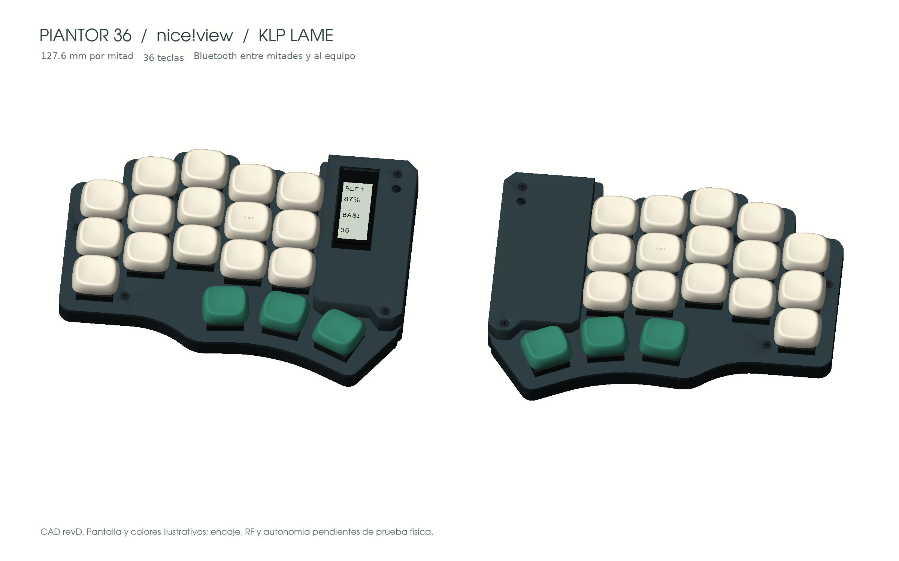

# Progreso

**En curso: revisión E — stack estrecho y módulos extraíbles.**

| Hito | Estado | Evidencia / siguiente paso |
|---|---|---|
| Layout de 36 teclas | Comprobado | [Coordenadas](../design/layout.json), fuentes y comprobador incluidos |
| Prototipo anterior, revisión D | Antecedente digital | Una pantalla izquierda, batería lateral y CAD local; imagen debajo |
| Stack batería → micro → pantalla | En diseño | Resolver cables, conectores, holguras y extracción |
| Dos pantallas y electrónica modular | En diseño | Actualizar ambas PCB, CAD y firmware; una pantalla sigue siendo alternativa |
| BOM y archivos para fabricar | Pendiente | Cerrar la revisión modular y publicar fuentes coherentes |
| Impresión y montaje | Pendiente | Cupón Choc, tres keycaps y comprobación de piezas reales |
| Teclado funcionando | Pendiente | 36 teclas, BLE, carga, sueño/despertar y consumo medido |

## 2026-09-21 · Inicio público

Se comparte el layout, la dirección del diseño y la lista de componentes prevista. El trabajo previo pasó de 42 a 36 teclas, recuperó el contorno angular e integró una pantalla. La revisión siguiente busca una bahía más estrecha y acceso independiente a la electrónica.

Filo36 es el nombre provisional; también se consideran Sesgo36 y Brizna36.

## Imagen de la revisión anterior

**Render CAD de revD, anterior al stack modular.** Utiliza las mallas KLP Lamé. No es una foto ni representa la revisión E: pantalla derecha ausente, bahía todavía ancha y pantalla izquierda soldada. El estado dibujado en pantalla y el asiento de keycaps son ilustrativos. [Atribución de la imagen](../ATTRIBUTION.md).
