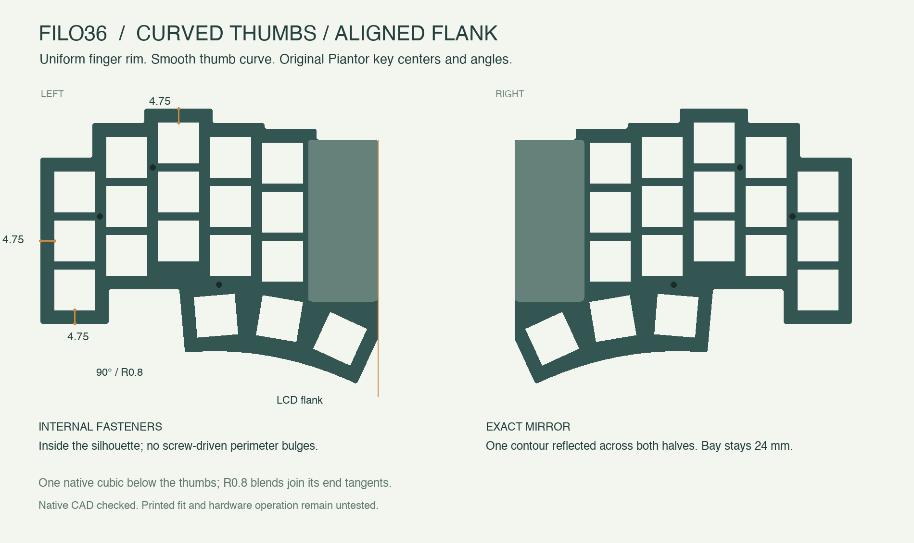

# Revision I review

**Chosen Contour outline, magnetic frames and two battery profiles. Digital prototype only.**

The source reference requested a stepped finger outline, rectangular pinky foot, shallow recess and continuous thumb fan. The actual CAD and PCB now use that contour while preserving all 36 Piantor key transforms. Internal fasteners and magnetic stations add no perimeter lobes.

Two independent read-only reviews covered geometry/serviceability and failure modes before the magnetic design was adopted. The recorded source snapshots stayed unchanged during their review. [Decision record](../validation/revI-design-review.json).

## LCD flank and thumb curve

The previous uniform-rim revision extended **2.551 mm beyond the LCD frame** and used three flat thumb edges. The revised contour stops at left X=135 / right X=25 and joins the lower thumb corners with one native cubic. Tangents match the adjacent R0.8 arcs. The PCB, tray and plate derive from that same source. No key, mount, magnet or battery position changes.

The pinky foot already had **90° backbone corners with R0.8 blends**. Perspective and rounded keycaps can obscure that orthogonality; the top drawing below shows it directly. Finger margins retain 4.75 mm; the newly requested thumb curve intentionally replaces constant margins there.

[Both independent read-only reviewers](../validation/revI-lcd-curve-review.json) recommended these constrained changes, preserving actual copper clearance of at least 0.5 mm. Current tests check actual pad polygons, mirrored native solids, cubic sketches, and regression fixtures for both earlier contour defects. The PCB minimum remains approximately 0.524 mm.

The viewer’s full View controls now occupy their own fixed space below the canvas. Part links explains the selection/visibility requirement; Fit view confirms reframing and handles an empty scene. Whole-row hover includes the explicit eye, with independent visibility activation. The follow-up adds per-piece checkboxes, Solo/Show all recovery, and temporary X-ray hover through occluding parts. Browser acceptance covers persistent controls, zoom-to-fit using rendered pixels, empty states, keyboard use, collapsed details, 320 px portrait and short landscape.

## Uniform rim correction — prior revision

The earlier contour was mirrored, but its exposed margins varied from **2.53 to 5.42 mm**. Hand-entered vertices and a containment-only test allowed that discrepancy. That revision derived its faces from the switch openings at **4.75 mm**, with offset thumb edges and H1 relocated to **(38.7, 37.5)** inside the first two columns. Its post is R2.1; the M2 screw is unchanged.

Why 4.75? The outer thumb hot-swap pad reaches 9.575 mm from its center. Preserving the 1.65 mm case-to-PCB offset and 0.5 mm copper rule requires at least **4.725 mm** of visible rim. A 4 mm draft cut that pad. Its envelope was 119.30 × 95.10 mm; its area differs by only 0.0072% from the previous contour. The electronics bay stays 24 mm.

The left contour alone generates both halves. Measured straight faces, R0.8 corner blends, internal bridges and the bay joint have separate definitions. The test rejects the old outline and reads the actual native plate solids; it does not treat every interior key as peripheral. [Rim measurements](../validation/revI-rim-solids.json) · [Fastener/keycap travel](../validation/revI-fasteners.json) · [Decision and correction record](../validation/revI-rim-review.json).

The current diagram above supersedes that geometry; the previous receipt and regression fixture preserve its measurements.

## Earlier corrections during verification

- H3 was outside the new recess: it moved into existing material. H4/H5 moved below the electronics, with short screws and underside head reliefs.
- The earlier wide battery opening violated the copper-edge rule: the saddle now stays below the board, with only the cell/cage crossing a 12.5 mm opening.
- An initial magnet position cut a K25 pad: actual pad polygons exposed the conflict. Stations moved south; J1 and SW1 moved to preserve clearance. The power switch also moved inward. No key moved.
- The battery cage touched the controller support: the rear support bridge moved clear of the cage.

Both KiCad studies have **0 geometric violations and 104 unconnected items per half**. This is not a routed-board DRC pass or fabrication release. The original 0.5 mm copper-edge rule remains in force; measured minimum pad clearance is approximately 0.524 mm.

- A frame could fit at rest yet catch the MCU while lifting. Its internal relief now opens to the lower rim; sampled extraction checks cover all six styles.
- A FreeCAD link dropped a battery box's placement. Each battery variant now has a native compound wrapper, and independent bounds checks verify the active link, exported mesh and configuration swap.

## Physical work still open

Magnetic holding force, north-edge peel, closed-pocket print capture, actual magnet temperature, printed M2 threads and cycling need coupons. Both battery fits use supplier nominal dimensions; wrapping, insulation, protection electronics, cable terminals and connector polarity must be checked on delivered parts. Socket heights, hot-swap assembly, firmware, charging, BLE and consumption remain unverified.

The wire study reserves two 105 mm paths with 1.5 mm bends and 0.6 mm insulation diameter. It is not a terminal-complete harness. Sampled frame lifts are nominal collision checks, not a continuous tolerance analysis or a physical extraction test.

[Mechanical](../validation/revI-mechanical.json) · [Outline and clearances](../validation/revI-outline.json) · [Electrical](../validation/revI-electrical.json) · [Service and coupons](../validation/revI-service.json) · [Build sequence](build.md).
