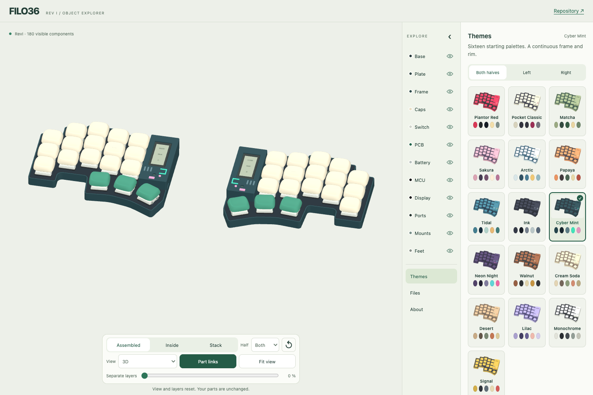

# Make it yours

Open [the 3D explorer](https://eduarbo.github.io/filo36/), choose **Themes**, and pick a starting palette. Sixteen presets coordinate the case and frame. Their previews use your selected shapes.

1. Choose **Both halves**, **Left** or **Right**.
2. Pick a theme. It changes colors while preserving shapes, keycaps and installed covers.
3. In **Base**, edit the base/rim and key plate. In **Frame**, edit the body and raised details.
4. Enable **Match frame and rim** for continuous color. Editing either linked color updates the other.
5. Use **Files → Download print kit** for the selected parts.

Handheld, Retro TV and Cyberpunk have four color regions. Smooth, Bevel and Facet use a single body color. Original design palettes remain available through **Restore design colors**.

Changing shapes preserves customized colors. An untouched original design adopts the new shape's original palette. Switching a frame reinstalls its cover; applying a color theme does not.

## Keep your configuration

Selections save automatically on this device. **Save configuration** downloads JSON for another browser or the FreeCAD configuration macro. JSON carries explicit colors, shapes and cover installation, so a preset name never changes an old saved design. Legacy JSON still loads.

Eye, Solo, camera and exploded views are inspection controls. They do not remove parts from the print kit. Unchecking **Printed display cover** does remove that cover and its targets from the selected assembly.

## Printable parts and joining

**Shells** exports each selected case, key plate and installed frame. **Complete printed set** also includes the battery saddle, cage, controller support, display support and three printed washers per half. Commercial parts and KLP keycaps are excluded; [keycap sources and fit guidance](customize.md#klp-lamé) remain separate.

- The structural case uses three M2 × 6 and two M2 × 4 screws per half. Tap the 1.7 mm pilot holes to M2.
- Each installed frame uses three captive Ø2 × 3 mm magnets and three Ø2 × 4 mm ferromagnetic pins.
- Cavities, guides and screw holes belong to the CAD geometry. Plan insertion pauses for captive hardware before slicing.
- There is no clip variant yet. A color or theme does not change the joining method.

The ZIP includes the selected geometry, JSON and a manifest with quantities, source hashes, units, colors and joining details. STL coordinates are the unchanged native assembly coordinates, in millimetres. Prepare orientation, supports, tolerances and your actual filament in the slicer.

This is prototype geometry. Print [fit coupons](cases.md) before a complete set. Neither magnets, tapped threads nor the whole assembly have physical acceptance yet.

## Color 3MF status

The generic 3MF files preserve the same triangles and assign surface regions; each part is translated onto Z=0. The manifest records that translation and all colors. They contain no printer or process profile.

**Bambu Studio color setup remains manual.** Its CLI preserves the painted regions, but does not automatically restore this generic file's color palette. Add four filament entries in **body, detail, accent, secondary** order using the manifest colors, then inspect each region. Automatic palette import and GUI save/reopen are not yet accepted. Use the unchanged STL if you prefer to paint the regions yourself.
