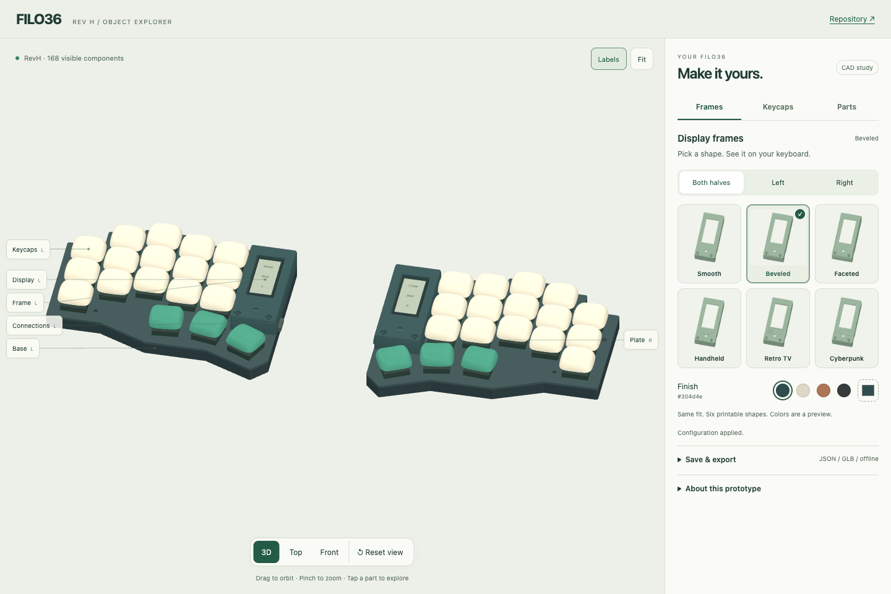

# Explore the assembly

**[Open the 3D viewer →](https://eduarbo.github.io/filo36/)**

Drag to orbit, scroll or pinch to zoom, and use two fingers to pan. **3D**, **Top** and **Front** sit beside the model; **Parts → Camera** includes the remaining views. **Fit** centers visible parts. **Reset view** restores the assembled view and keeps your choices.

## Pick, preview, inspect

- **Frames:** click a thumbnail to apply that printable shape immediately. Choose **Both halves**, **Left** or **Right** first. Changing shape preserves each half’s color; color swatches apply immediately. Mixed styles or colors are shown explicitly.
- **Keycaps:** click an illustrated preset, or open **Edit keys** for a key, row or thumb cluster. Variant and rotation choices are checked before **Apply to these keys**.
- **Parts:** select a component for information, hover or focus to highlight it, and use the eye to show or hide its layer. **Inside**, **Stack**, half filters and **Separate layers** expose the assembly.

Thin lines connect labels to visible component surfaces. Hover or focus a label to highlight its part; click or tap to open its information. Selecting **Frame** opens the frame grid for that half. You can also click a visible part directly in 3D. Dragging or using two fingers does not select a part. Clear the selection with **×** or **Escape**.

Labels follow orbit, camera, layer and exploded-view changes. Repeated parts share a label; fewer labels appear on small screens. Occluded or hidden parts are omitted from the on-model labels but remain available in **Parts**. **Labels** hides the annotations. On a phone, the model stays visible while the explorer scrolls independently.

## Keep your choices

Open **Save & export** for **Save configuration**, **Load JSON**, **Restore default parts**, GLB and offline downloads. JSON transfers choices to another browser or [FreeCAD](customize.md#save-a-configuration-for-freecad). Restoring defaults changes parts; resetting the view does not.

**Download offline HTML** saves the entire viewer, including geometry, previews, code and licenses. Previews are rendered once from the embedded meshes. No network requests are needed to run that file. The first load may take longer on a phone because it includes the supported keycap meshes.

**Download assembled GLB** exports all installed parts in their assembled positions, including the selected keycaps and frames. Hidden layers, exploded offsets, labels and highlights do not change the exported assembly. GLB uses meters and retains source/license metadata; FreeCAD/STEP is the route for solid editing.

This is a nominal CAD study. See [dimensions and limitations](cad.md), [customization rules](customize.md) and [parts](parts.md). Browser checks cover desktop and emulated narrow touch viewports; physical phone and hardware acceptance remain separate.
