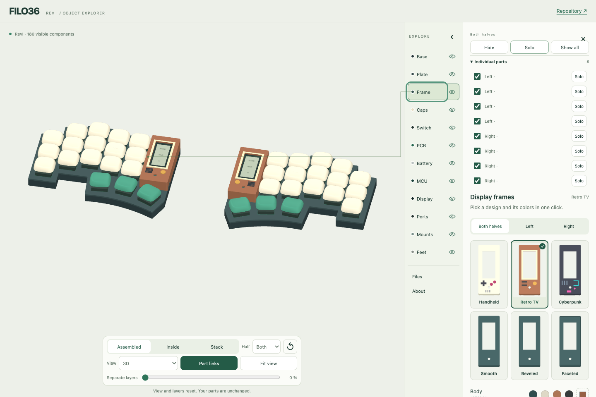

# Explore the assembly

**[Open the 3D viewer →](https://eduarbo.github.io/flan36/)**

The component directory stays visible while you inspect or customize the keyboard. Its 12 entries include **Frame**, **Caps**, **PCB**, **Battery** and **MCU**. Open an entry for its controls or information; use its eye to show or hide that layer. Open **Individual parts** within a selected entry to toggle a single piece. **Hide / Show** acts on the selection, **Solo** hides everything else, and **Show all** restores every piece and both halves. Each individual piece also has its own Solo button. **Files** and **About** remain beside the directory. View controls have a fixed bar below the model, independent of the details panel.

## Follow a component

Hover anywhere across a directory row, including its eye, or focus an entry to highlight its visible parts. Click or tap to keep the selection. A selected frame keeps its actual colors; its surface highlight appears only while hovering or focusing the component entry. You can also select a part directly in 3D. A fine line connects the active visible part to its exact directory entry; there are no floating tags. Hover uses a temporary translucent X-ray highlight, so parts remain identifiable behind the case or display. It also previews deliberately hidden pieces without changing their visibility. When no visible surface is available, the hover line points into that component. Leaving hover restores the assembly; selecting an occluded part does not keep the X-ray active.

**Frame** opens six actual-mesh previews. Choose a half, then click a thumbnail to apply the shape immediately. A thumbnail applies that design and its original multicolor palette. **Body** overrides the shell color while preserving the theme’s accents; **Restore design colors** resets it. The front-facing previews show the actual raised details. **Caps** opens KLP presets and individual key editing. **Battery** switches between Adafruit 1570 and 301230 in the shared cradle. Other entries explain the component and its current limitations.

The arrow beside the directory collapses only the details. Component names and section controls stay visible, including while the details scroll. The mobile directory uses a compact grid; all entries stay visible while the detail area scrolls and the model stays on screen.

Clear a selection with **×** or **Escape**. **Part links** toggles the connecting line and explains when selection or visibility is needed. During a camera gesture, the line pauses; it reconnects after the gesture settles. Expensive surface searches no longer run during every camera update.

## Move and inspect

Drag to orbit, scroll or pinch to zoom, and use two fingers to pan. The fixed **View** selector includes 3D, Top, Front, Bottom and side views. **Fit view** centers and fits visible parts without changing the angle; it reports when nothing is visible. **↺** resets the view and layers while keeping your chosen parts.

The same always-visible bar contains **Assembled**, **Inside**, **Stack**, half selection and **Separate layers**. Exploded spacing is a viewing aid; it does not alter saved geometry. Dragging or using two fingers does not select components.

## Keep your choices

Open **Files** for Save configuration, Load JSON, Restore default parts, GLB and offline downloads. JSON transfers selections to another browser or [FreeCAD](customize.md#save-a-configuration-for-freecad). Restoring defaults changes parts; resetting the view does not.

**Download offline HTML** includes geometry, previews, code and licenses. It needs no network requests after download. The file remains about 33 MiB because it contains the original supported meshes; first-load time depends on the device and connection.

**Download assembled GLB** exports all installed parts in their assembled positions, with the selected keycaps, frames, colors and battery profiles. Hidden layers, exploded offsets, lines and highlights do not alter the exported assembly. GLB uses meters and retains attribution; use FreeCAD/STEP for solid editing.

This remains a nominal CAD study. See [dimensions and limitations](cad.md), [customization rules](customize.md) and [parts](parts.md). Browser checks distinguish desktop and emulated touch viewports from physical-phone and hardware acceptance.
